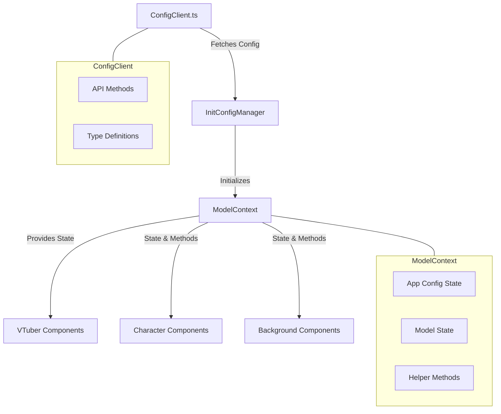
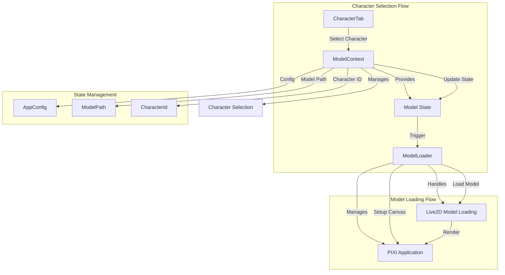
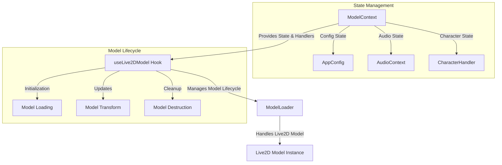
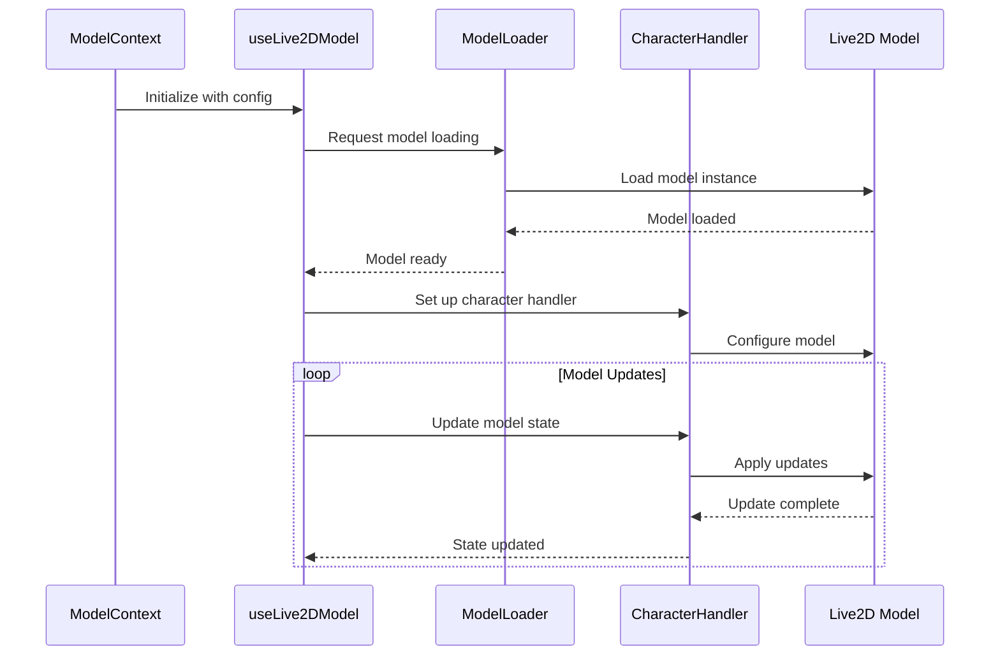
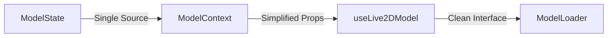
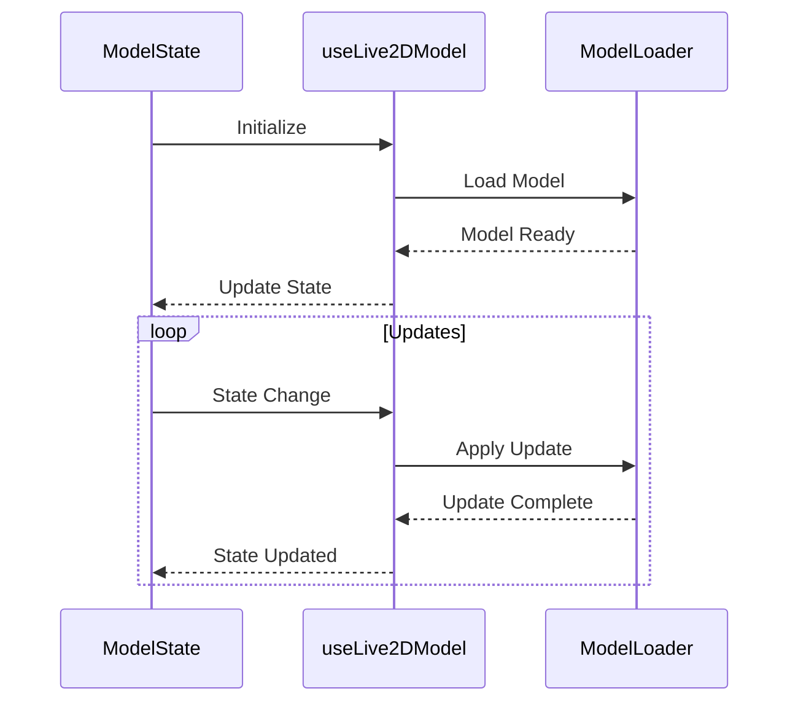
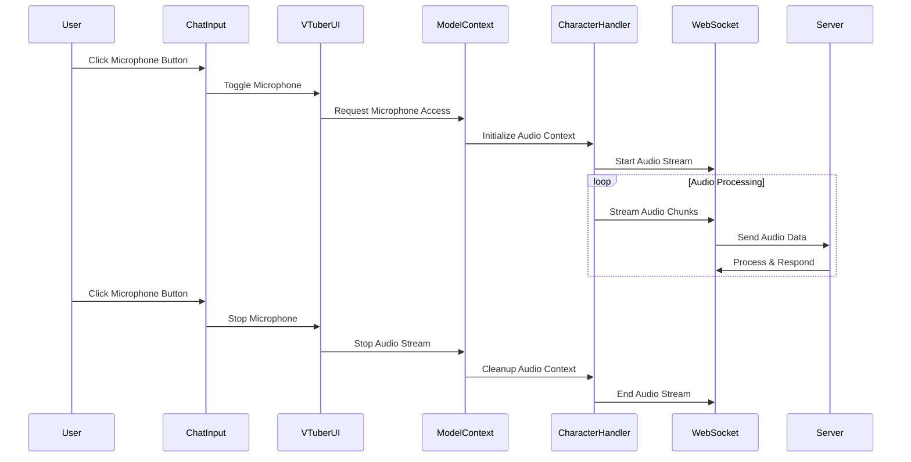

# AIdol-Vtuber: VTuber Platform

**⚠️ Work in Progress (WIP)** - This project is actively under development.

AIdol-Vtuber is an AI-powered VTuber platform designed to integrate with Twitch and other livestreaming services. The platform provides Live2D character support, real-time WebSocket communication, and comprehensive livestreaming capabilities for creating interactive AI VTuber experiences.

## Platform Overview

This platform is designed to hook into Twitch and other livestreaming services, providing a complete solution for AI-driven VTuber interactions. It integrates with the [Hiero network](https://character.hiero.gl) (integration status: TBD), enabling seamless character interactions across the network.

### Related Projects

- **[character.hiero.gl](https://character.hiero.gl)** - Example implementation and character showcase
- **[szar.ourosociety.com](https://szar.ourosociety.com)** - Project resources and documentation
- **[ourosociety.com](https://ourosociety.com)** - Main project website
- **[Voice Model Platform](https://v0-voice-model-ux.vercel.app/)** - Voice model marketplace and management

### Coming Soon

- **Character Models Marketplace**: Browse and purchase Live2D character models designed specifically for the AIdol-Vtuber platform
- **Voice Library**: Access a curated collection of voice models and TTS options optimized for VTuber interactions

### Important Notice

**⚠️ Proprietary Models**: The Live2D models and character assets included in this repository are proprietary and protected by copyright. These models may not be copied, distributed, or used without explicit consent and payment. Unauthorized use of these models is strictly prohibited.

## Project Structure

```
vaidol/
├── frontend/          # Next.js frontend application
├── backend/           # Backend services (orphiq reference)
└── docs/              # Documentation
```

## Quick Start

### Run Both Services (Recommended)

Use the provided script to run both frontend and backend together:

```bash
python run_dev.py
```

This will start:
- Frontend at `http://localhost:3000`
- Backend WebSocket at `ws://localhost:12393/client-ws`

Press `Ctrl+C` to stop both services.

### Run Services Separately

#### Frontend

```bash
cd frontend
npm install
npm run dev
```

The frontend will be available at `http://localhost:3000`

#### Backend

The backend (orphiq) is located in the `backend/` directory. See `backend/README.md` for details.

```bash
cd backend
python cli.py run
```

The backend WebSocket server runs at `ws://localhost:12393/client-ws`

## Features

- **Live2D Character Rendering**: Full support for Live2D models with expressions and motions
- **Real-time Communication**: WebSocket-based communication with backend
- **Character Control**: Expression and motion control via API
- **Audio Integration**: TTS, ASR, and lip-sync support
- **Twitch Streaming**: Architecture for Twitch livestreaming (see docs)

## Documentation

- [Twitch Livestreaming Architecture](docs/Twitch-Livestreaming-Architecture.md) - Complete architecture for Twitch integration
- [Expression and Motion System](docs/ExpressionAndMotion.md) - Character animation system
- [Audio Processing Architecture](docs/Audio-Processing-Architecture.md) - Audio system documentation
- [Live2D Model Loading](docs/Live2D-Model-Loading-Architecture.md) - Model loading system

---

# sense-ma: Your AI IDOL

Your dedicated AI companion for all your artificial intelligence needs. sense-ma is designed to be your personal assistant in navigating and implementing AI solutions.

## Features

- **AI Consultation**: Get expert advice on implementing AI solutions in your projects
- **Code Generation**: Receive AI-powered code suggestions and implementations
- **Model Selection**: Get guidance on choosing the right AI models for your use case
- **Integration Support**: Help with integrating various AI services and APIs
- **Best Practices**: Learn AI development best practices and optimization techniques

## Getting Started

First, run the development server:

```bash
npm run dev
# or
yarn dev
# or
pnpm dev
```

Open [http://localhost:3000](http://localhost:3000) with your browser to start chatting with your AI companion.

## How It Works

sense-ma leverages advanced language models and AI technologies to provide:

1. **Intelligent Conversations**: Natural dialogue interface for discussing AI concepts
2. **Technical Assistance**: Help with coding, debugging, and implementation
3. **Learning Resources**: Curated resources for AI development
4. **Project Planning**: Assistance in planning AI features and architectures

## Use Cases

- AI project planning and architecture
- Machine learning model selection and implementation
- Natural language processing applications
- Computer vision solutions
- AI integration with existing systems
- Performance optimization for AI models

## Technologies

This project is built with:
- [Next.js](https://nextjs.org) for the frontend framework
- Advanced AI models for intelligent interactions
- Real-time processing capabilities
- Secure data handling

## Contributing

We welcome contributions! Whether it's adding new features, improving documentation, or reporting bugs, your help makes sense-ma better for everyone.

## Deploy

Deploy your instance of sense-ma using [Vercel](https://vercel.com/new?utm_medium=default-template&filter=next.js&utm_source=create-next-app&utm_campaign=create-next-app-readme):

Check out our [deployment documentation](https://nextjs.org/docs/app/building-your-application/deploying) for more details.

## License

[Apache License 2.0](LICENSE) - Copyright 2024 Michael Holborn (mikeholborn1990@gmail.com)

This project is licensed under the Apache License 2.0, which means you can:
- Use the software for commercial purposes
- Modify the software and create derivative works
- Distribute copies and modifications
- Place warranty on the software

The complete license text can be found in the [LICENSE](LICENSE) file.

**Note**: While the software code is licensed under Apache 2.0, the Live2D models and character assets remain proprietary and are not covered by this license. See the [Important Notice](#important-notice) above for details.

# VTuber App State Management

## Architecture Overview

The VTuber app uses a centralized state management approach with React Context. The main state is managed by `ModelContext`, while configuration fetching is handled by `ConfigClient`.



## State Management Flow

1. **Initial Load**:
   - `InitConfigManager` fetches base configuration using `ConfigClient`
   - Configuration is passed to `ModelContext`
   - `ModelContext` becomes the source of truth for app state

2. **State Updates**:
   - Components receive state and update methods from `ModelContext`
   - All state modifications go through `ModelContext`
   - External API calls remain in `ConfigClient`

3. **Helper Methods**:
   - Utility functions like `findModelByName` and `findCharacterById` moved to `ModelContext`
   - These methods operate on the stored state

## Type Structure

```typescript
// Core state interfaces in ModelContext
interface ModelContextState {
  config: AppConfig;
  modelPath: string;
  characterId: string;
  backgroundPath: string;
}

// Methods provided by context
interface ModelContextValue extends ModelContextState {
  handleCharacterChange: (characterId: string, modelPath: string) => void;
  handleBackgroundChange: (backgroundPath: string) => void;
  findModelByName: (name: string) => Model | undefined;
  findCharacterById: (id: string) => Character | undefined;
}
```

## Key Components

- **ModelContext**: Central state management
- **ConfigClient**: External API communication
- **InitConfigManager**: Configuration initialization
- **VTuber Components**: State consumers

# VTuber App Model Management Flow

## Architecture Overview

The VTuber app uses a centralized model loading system with character selection managed through context. Here's how the components interact:



## Component Responsibilities

### ModelContext
- Manages character selection state
- Provides character selection methods
- Maintains model configuration
- Triggers model loading through state changes

### ModelLoader
- Handles Live2D model initialization
- Manages PIXI application lifecycle
- Handles model loading/unloading
- Manages model positioning and scaling

### CharacterTab
- Displays available characters
- Handles character selection UI
- Triggers character changes through context

## State Flow

1. **Character Selection**:
   ```
   CharacterTab
   └── Select Character
       └── ModelContext
           └── Update State
               └── ModelLoader
                   └── Load New Model
   ```

2. **Model Loading**:
   ```
   ModelLoader
   ├── Unload Current Model
   ├── Cleanup PIXI App
   ├── Initialize New PIXI App
   └── Load New Model
   ```

3. **State Management**:
   ```
   ModelContext
   ├── Character Selection
   ├── Model Configuration
   └── Model State
   ```

## Key Interactions

1. **Character Change**:
   - User selects character in CharacterTab
   - ModelContext updates state
   - ModelLoader detects state change
   - ModelLoader handles model transition

2. **Model Loading**:
   - ModelLoader manages PIXI application
   - Handles model loading/unloading
   - Manages model positioning and scaling
   - Provides model interaction capabilities

3. **State Synchronization**:
   - ModelContext maintains source of truth
   - ModelLoader responds to state changes
   - CharacterTab reflects current selection

# Live2D Model State Management

This document explains how state is managed and data flows between the Live2D model components.

## Component Architecture



## Data Flow



## State Management

### ModelContext
- Central state management for the application
- Manages:
  - Model configuration
  - Audio context
  - Character handler
  - Global state updates

### useLive2DModel Hook
- Manages model lifecycle
- Handles:
  - Model loading/unloading
  - Transform updates
  - Animation state
  - Mouse interaction

### ModelLoader
- Handles technical aspects of Live2D model
- Manages:
  - Model instantiation
  - Resource loading
  - PIXI.js integration
  - Model cleanup

## Current Complexity

The current implementation has several areas of complexity:

1. **Multiple State Sources**
   - State is split between context and hook
   - Redundant state tracking
   - Complex state synchronization

2. **Prop Drilling**
   - Many props passed through components
   - Complex prop types
   - Difficult to track state changes

3. **Complex Lifecycle Management**
   - Multiple initialization points
   - Complex cleanup procedures
   - Difficult to debug state issues

## Suggested Simplifications

1. **Unified State Management**


2. **Simplified Data Flow**


### Proposed Changes

1. **Centralize State**
   - Move all state to ModelContext
   - Use reducers for state updates
   - Implement proper state immutability

2. **Simplify Props**
   - Reduce prop drilling
   - Use context for shared state
   - Implement proper TypeScript types

3. **Streamline Lifecycle**
   - Single initialization point
   - Clear cleanup procedures
   - Better error handling

4. **Improve Type Safety**
   - Remove any types
   - Implement proper interfaces
   - Add runtime type checking

### Example Implementation

```typescript
// Simplified ModelState
interface ModelState {
  config: ModelConfig;
  model: Live2DModel | null;
  transform: ModelTransform;
  audio: AudioState;
  character: CharacterState;
}

// Simplified Context
const ModelContext = createContext<ModelState>(null);

// Simplified Hook
function useLive2DModel() {
  const state = useContext(ModelContext);
  const dispatch = useReducer(modelReducer, initialState);
  
  // Simplified lifecycle
  useEffect(() => {
    initializeModel();
    return cleanupModel;
  }, []);
  
  return {
    ...state,
    updateTransform: (transform: ModelTransform) => 
      dispatch({ type: 'UPDATE_TRANSFORM', payload: transform }),
    // ... other actions
  };
}
```

## Benefits of Simplification

1. **Better Maintainability**
   - Clear state management
   - Easier debugging
   - Better type safety

2. **Improved Performance**
   - Reduced re-renders
   - Better resource management
   - Optimized updates

3. **Enhanced Developer Experience**
   - Clearer API
   - Better documentation
   - Easier testing

4. **Reduced Complexity**
   - Fewer moving parts
   - Clearer data flow
   - Better error handling

# Microphone Audio Streaming System

## Overview
This system handles microphone input, processes it through the WebSocket connection, and manages the audio context for the VTuber application.

## System Flow


## Key Components

1. **ChatInput Component**
   - Handles microphone button UI
   - Toggles recording state
   - Provides visual feedback

2. **VTuberUI Component**
   - Manages microphone state
   - Coordinates between UI and audio processing
   - Handles WebSocket communication

3. **ModelContext**
   - Manages audio context
   - Handles microphone permissions
   - Coordinates with CharacterHandler

4. **CharacterHandler**
   - Processes audio data
   - Manages audio context
   - Streams data to WebSocket

5. **WebSocket Context**
   - Handles real-time communication
   - Streams audio data to server
   - Manages connection state

## Implementation Notes

- Audio is processed in chunks for real-time streaming
- WebSocket connection is maintained throughout the session
- Audio context is managed separately from character audio
- System includes comprehensive logging for debugging
- Error handling at each step of the process

## Debug Logging

Key points for logging:
1. Microphone permission status
2. Audio context initialization
3. WebSocket connection state
4. Audio chunk processing
5. Stream start/stop events
6. Error conditions
