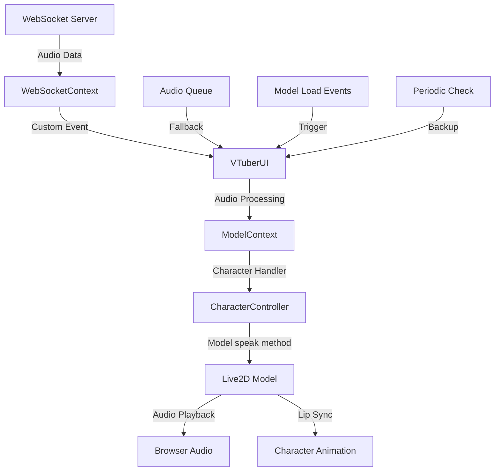
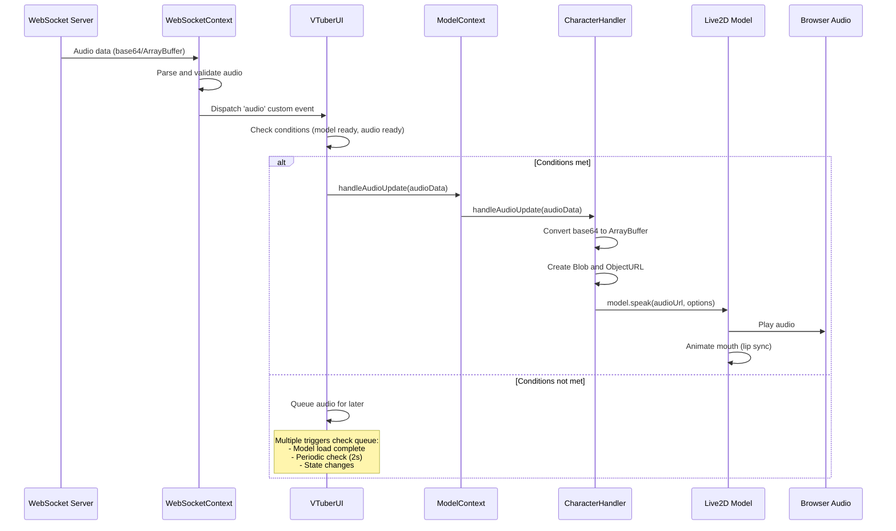
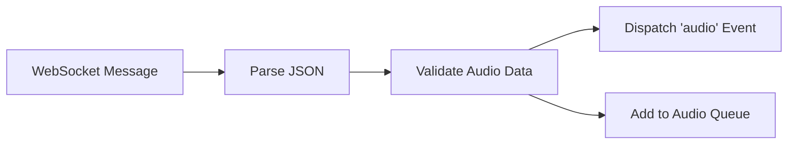
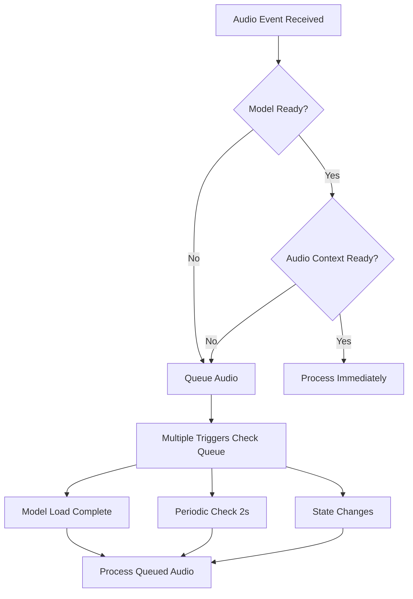
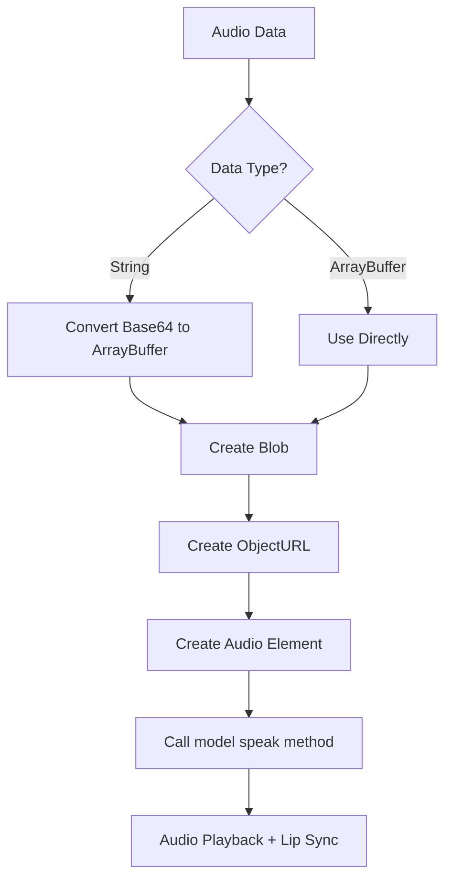
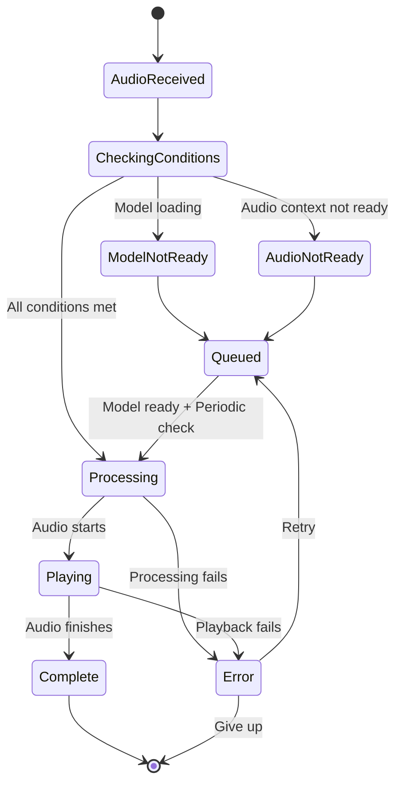

# Audio Processing Architecture

## Overview

This document describes the audio processing architecture in the VTuber application, explaining how audio data flows from the WebSocket server to the Live2D model for playback and lip-sync animation.

## Why Audio is Played in the Browser

The audio is played in the browser for several important reasons:

1. **Real-time Processing**: The browser provides immediate access to audio APIs for real-time processing and playback
2. **Lip-sync Integration**: The Live2D model requires direct access to audio data for mouth movement synchronization
3. **User Experience**: Playing audio locally ensures low latency and smooth interaction
4. **Cross-platform Compatibility**: Browser audio APIs work consistently across different operating systems
5. **Security**: Audio processing happens client-side, reducing server load and potential security concerns

## Audio Flow Architecture

### High-Level Flow Diagram



### Detailed Component Flow



## Component Responsibilities

### 1. WebSocketContext
- **Purpose**: Receives audio data from the server
- **Key Functions**:
  - Parse incoming WebSocket messages
  - Validate audio data format
  - Dispatch custom events to other components
  - Maintain audio queue as backup



### 2. VTuberUI (Centralized Audio Processing)
- **Purpose**: Central coordinator for all audio processing
- **Key Functions**:
  - Listen for audio events from WebSocketContext
  - Check if model and audio context are ready
  - Queue audio if conditions not met
  - Process queued audio when ready
  - Handle multiple fallback mechanisms



### 3. ModelContext
- **Purpose**: Provides audio processing interface to components
- **Key Functions**:
  - Maintain character handler reference
  - Provide audio update methods
  - Manage model state and readiness

### 4. CharacterHandler
- **Purpose**: Core audio processing and Live2D integration
- **Key Functions**:
  - Convert audio data formats (base64 → ArrayBuffer)
  - Create audio blobs and URLs
  - Interface with Live2D model's speak method
  - Handle lip-sync animation
  - Manage audio queue and playback state



## Audio Processing States

### State Machine Diagram



## Fallback Mechanisms

The system includes multiple fallback mechanisms to ensure audio is processed:

### 1. Immediate Processing
- When model and audio context are ready
- Direct processing without queuing

### 2. Model Load Complete Event
- Triggers when Live2D model finishes loading
- Processes any queued audio

### 3. Periodic Check (2-second interval)
- Backup mechanism for missed events
- Ensures queued audio is eventually processed

### 4. State Change Triggers
- Monitors changes in model readiness
- Processes queue when conditions are met

## Audio Data Format

### Input Format (from WebSocket)
```typescript
interface AudioData {
  data: ArrayBuffer | string;        // Audio data (base64 string or binary)
  format?: string;                   // Audio format (mp3, wav, etc.)
  timestamp?: number;                // Timestamp of audio
  duration?: number;                 // Duration in milliseconds
  volumes?: number[];                // Volume data for lip sync
  slice_length?: number;             // Length of volume slices
  display_text?: {                   // Text to display
    text: string;
    name?: string;
    avatar?: string;
  };
  actions?: {                        // Actions to perform
    expressions?: Array<number | string>;
    [key: string]: unknown;
  };
}
```

### Processing Flow
1. **Base64 Decoding**: Convert base64 string to ArrayBuffer
2. **Blob Creation**: Create audio blob with proper MIME type
3. **URL Generation**: Generate object URL for audio element
4. **Model Integration**: Pass URL to Live2D model's speak method
5. **Playback**: Model handles audio playback and lip sync

## Error Handling

### Common Issues and Solutions

1. **Audio Not Playing**
   - **Cause**: Model not ready or audio context issues
   - **Solution**: Multiple fallback mechanisms ensure eventual processing
   - **Recent Fix**: Removed strict audio context requirement - audio now processes when model is ready

2. **Base64 Decoding Errors**
   - **Cause**: Invalid base64 data
   - **Solution**: Validation and error logging in CharacterHandler

3. **Model Speak Method Failures**
   - **Cause**: Live2D model not properly initialized
   - **Solution**: Queue audio until model is ready

4. **Audio Context Issues**
   - **Cause**: Browser audio context suspended or not ready
   - **Solution**: Automatic context creation, resumption, and fallback mechanisms
   - **Recent Fix**: Audio context is created immediately and fallback contexts are available

5. **WebGL Context Issues**
   - **Cause**: WebGL context lost or not properly initialized
   - **Solution**: Comprehensive WebGL context monitoring and error recovery
   - **Note**: This affects model rendering but not audio processing

## Performance Considerations

### Optimization Strategies

1. **Audio Queue Management**
   - Limit queue size to prevent memory issues
   - Process one audio at a time to avoid conflicts

2. **Memory Management**
   - Clean up object URLs after playback
   - Remove processed audio from queue

3. **Error Recovery**
   - Automatic retry mechanisms
   - Graceful degradation on failures

## Debugging

### Console Logs

The system provides extensive logging for debugging:

- `[WebSocket]` - WebSocket connection and message handling
- `[VTuberUI]` - Centralized audio processing decisions
- `[ModelContext]` - Model state and audio routing
- `[CharacterHandler]` - Audio processing and Live2D integration

### Key Log Messages

- `"Audio response received (CENTRALIZED AUDIO PROCESSING)"` - Audio received
- `"Queueing audio for later processing"` - Audio queued due to conditions
- `"Processing audio immediately"` - Audio processed without queuing
- `"Model ready - processing queued audio items"` - Queue processing triggered
- `"Audio playback started"` - Audio successfully started playing

## Conclusion

The audio processing architecture provides a robust, multi-layered approach to handling audio in the VTuber application. By centralizing audio processing in VTuberUI and implementing multiple fallback mechanisms, the system ensures reliable audio playback and lip-sync animation even under challenging conditions.

The browser-based approach offers the best balance of performance, compatibility, and user experience for real-time audio processing and Live2D model integration.
