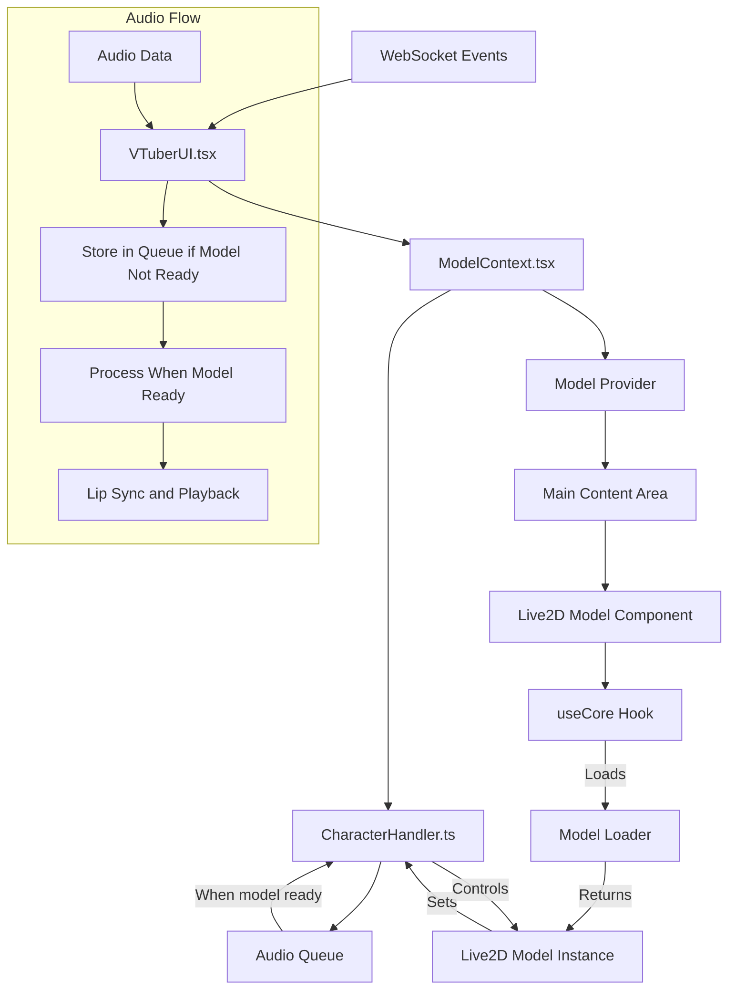

# VDOL Audio Architecture

## Current Architecture Overview

The current audio system consists of several interconnected components:

1. **VTuberUI.tsx**: The top-level component that initializes both AudioManager and AudioStateManager.
2. **AudioManager.ts**: Handles low-level audio operations (playback, permissions).
3. **AudioStateManager.ts**: Manages audio state, scheduling, and volume updates.
4. **ModelContext.tsx**: Provides audio context and state to the application.
5. **CharacterHandler.ts**: Handles model animation and lip-sync.
6. **useCore.tsx**: Hook that manages Live2D model state including audio processing.
7. **Live2DModel.tsx**: UI component that displays the model.
8. **ModelLoader.tsx**: Loads the Live2D model.

## Current Issues

The current system suffers from several issues:

1. **Timing and Dependency Problems**: The `CharacterHandler` needs access to the Live2D model, but the model isn't loaded when audio arrives.
2. **Duplicate Audio Management**: Audio handling is split between `AudioManager`, `AudioStateManager`, and `CharacterHandler`.
3. **Race Conditions**: Audio data might arrive before the model is loaded.
4. **Initialization Order**: AudioContext may not be initialized correctly when needed.

Error messages observed:
- `[CharacterHandler] Cannot handle audio update: model not available`
- `[CharacterHandler] AudioContext not initialized`

## Proposed Architecture

A better architecture would:

1. Consolidate audio management into `CharacterHandler`
2. Ensure proper initialization order
3. Handle cases where audio arrives before the model is loaded
4. Simplify the flow of audio data

### Mermaid Diagram of the Proposed Architecture

## Implementation Recommendations

1. **Consolidate Audio Management**:
   - Remove `AudioManager` and `AudioStateManager`
   - Move all audio functionality to `CharacterHandler`

2. **Initialize Audio Context Early**:
   - Initialize AudioContext in `VTuberUI` or `ModelContext`
   - Pass initialized context to `CharacterHandler`

3. **Queue Audio Data**:
   - Store incoming audio data in a queue
   - Process queue when model becomes available

4. **Lazy Load Model in VTuberUI**:
   - Consider moving model loading to VTuberUI
   - This would ensure proper initialization order

5. **Create Clear Communication Channels**:
   - Use events or callbacks to signal when models are ready
   - Ensure audio processing waits for model availability

## Code Changes Required

1. **VTuberUI.tsx**:
   - Initialize AudioContext early
   - Handle WebSocket audio data
   - Queue audio data if model not ready

2. **CharacterHandler.ts**:
   - Add queue processing capability
   - Implement robust checks for model availability
   - Add retry mechanism for audio processing

3. **ModelContext.tsx**:
   - Ensure CharacterHandler is properly initialized
   - Pass model references to CharacterHandler when available

4. **useCore.tsx**:
   - Notify when model is loaded and ready
   - Ensure CharacterHandler gets model reference

## Best Approach for Audio Context Initialization

The AudioContext should be initialized at the highest possible level to ensure it's available everywhere:

1. Initialize in `VTuberUI.tsx` on component mount
2. Pass the initialized context to ModelProvider
3. ModelProvider passes it to CharacterHandler
4. When audio arrives, it's immediately queued
5. Once the model is loaded, CharacterHandler processes the queue

This approach ensures the AudioContext is ready when needed and prevents race conditions.

## Benefits of This Architecture

1. **Simplified Flow**: One clear path for audio data
2. **Reduced Duplication**: Audio handling in one place
3. **Better Error Handling**: Clear error states and recovery
4. **Proper Initialization Order**: Context before model before audio
5. **Robust Queue System**: No lost audio data during load

## Implementation Priority

1. Consolidate audio handling to CharacterHandler
2. Initialize AudioContext early in VTuberUI
3. Implement audio queue system
4. Update model loading to signal readiness
5. Add proper error handling and recovery 