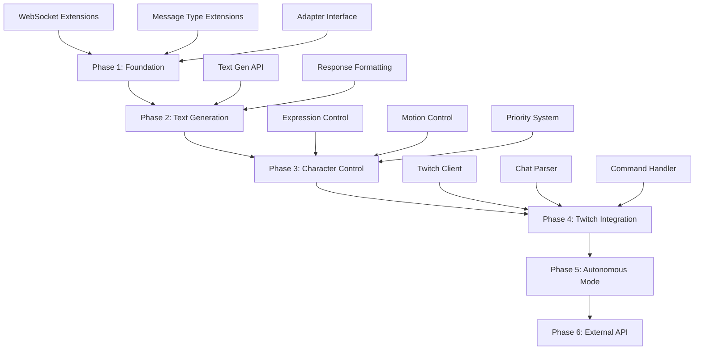

# Backend Twitch Livestreaming Integration - Implementation Todo

## Executive Summary

This document outlines the implementation plan for updating the backend to support the Twitch Livestreaming Architecture. The plan prioritizes **Foundation First + Risk Mitigation** approach, ensuring we build on solid infrastructure while maintaining backward compatibility.

## Priority Analysis: 5 Angles Considered

### Angle 1: Foundation First (Infrastructure)
**Approach**: Build core infrastructure first (adapters, interfaces, message protocols)
- ✅ Pros: Everything else builds on this
- ❌ Cons: No immediate user-facing value
- **Verdict**: Strong candidate - needed for everything

### Angle 2: User-Facing Features First (Value)
**Approach**: Start with text generation, expression control (immediate value)
- ✅ Pros: Quick wins, visible progress
- ❌ Cons: May require refactoring later, harder to test without foundation
- **Verdict**: Better as Phase 2

### Angle 3: Integration Points First (Compatibility)
**Approach**: Start with WebSocket extensions, message handlers
- ✅ Pros: Enables frontend integration immediately
- ❌ Cons: May duplicate work if foundation changes
- **Verdict**: Good complement to Foundation First

### Angle 4: Risk Mitigation First (Safety)
**Approach**: Start with non-breaking additions (new endpoints, optional features)
- ✅ Pros: Zero risk to existing functionality
- ✅ Pros: Easy to test incrementally
- ❌ Cons: May feel like slower progress
- **Verdict**: Best approach for production system

### Angle 5: Dependency Chain First (Logical)
**Approach**: Build in dependency order (adapters → text gen → control → Twitch)
- ✅ Pros: Logical progression
- ❌ Cons: May delay valuable features
- **Verdict**: Good for planning, but can be optimized

## Selected Approach: Foundation First + Risk Mitigation

**Rationale**: 
- Maintains backward compatibility (critical for production)
- Provides solid foundation for all future features
- Enables incremental testing and frontend integration
- Minimizes risk of breaking existing functionality

## Implementation Phases



## Phase 1: Foundation Layer (Weeks 1-2)

### Goal
Extend backend infrastructure to support new message types and adapter pattern without breaking existing functionality.

### Tasks

#### 1.1 Extend WebSocket Message Types
**File**: `backend/src/open_llm_vtuber/websocket_handler.py`

**Note**: The `MessageType` enum is currently for documentation only. Actual routing is done via the `_message_handlers` dictionary. We'll add new handlers directly.

**Changes**:
- Add new message type handlers (no enum changes needed):
  - `"expression-command"` - Direct expression control
  - `"motion-command"` - Direct motion control  
  - `"text-generation-request"` - On-demand text generation
  - `"set-backend-mode"` - Backend mode switching
  - `"get-backend-mode"` - Get current backend mode
  - `"twitch-connect"` - Connect to Twitch (future phase)
  - `"twitch-disconnect"` - Disconnect from Twitch (future phase)

**Testing**:
- Verify existing message types still work
- Test new message types are recognized
- Ensure backward compatibility

**Estimated Time**: 2 hours

---

#### 1.2 Create Backend Adapter Interface
**File**: `backend/src/open_llm_vtuber/adapters/__init__.py` (new)
**File**: `backend/src/open_llm_vtuber/adapters/base_adapter.py` (new)
**File**: `backend/src/open_llm_vtuber/adapters/orphiq_adapter.py` (new)

**Purpose**: Abstract backend differences behind a unified interface

**Base Adapter Interface**:
```python
from abc import ABC, abstractmethod
from typing import Optional, Dict, Any, AsyncIterator

class BackendAdapter(ABC):
    """Base interface for all backend adapters"""
    
    @abstractmethod
    async def generate_text(
        self, 
        prompt: str, 
        context: Optional[Dict[str, Any]] = None
    ) -> AsyncIterator[str]:
        """Generate text response"""
        pass
    
    @abstractmethod
    async def trigger_expression(
        self, 
        expression_id: int, 
        duration: Optional[int] = None,
        priority: int = 0
    ) -> Dict[str, Any]:
        """Trigger character expression"""
        pass
    
    @abstractmethod
    async def trigger_motion(
        self, 
        motion_group: str, 
        motion_index: int,
        loop: bool = False,
        priority: int = 0
    ) -> Dict[str, Any]:
        """Trigger character motion"""
        pass
    
    @abstractmethod
    async def get_character_state(self) -> Dict[str, Any]:
        """Get current character state"""
        pass
```

**Orphiq Adapter** (wraps existing functionality):
```python
class OrphiqAdapter(BackendAdapter):
    """Adapter for existing orphiq backend"""
    
    def __init__(
        self, 
        service_context: ServiceContext,
        websocket_send: Callable
    ):
        self.context = service_context
        self.websocket_send = websocket_send
    
    async def generate_text(self, prompt: str, context=None):
        # Use existing agent_engine.chat()
        batch_input = create_batch_input(
            input_text=prompt,
            images=None,
            from_name=self.context.character_config.human_name
        )
        agent_output = self.context.agent_engine.chat(batch_input)
        async for output in agent_output:
            # Process and yield text
            yield output.display_text.text
```

**Testing**:
- Unit tests for adapter interface
- Integration test with existing orphiq backend
- Verify all methods work correctly

**Estimated Time**: 8 hours

---

#### 1.3 Add Message Handlers for New Types
**File**: `backend/src/open_llm_vtuber/websocket_handler.py`

**New Handler Methods**:
```python
async def _handle_expression_command(
    self, websocket: WebSocket, client_uid: str, data: WSMessage
) -> None:
    """Handle expression command from client"""
    expression_id = data.get("expression_id")
    duration = data.get("duration", 0)
    priority = data.get("priority", 0)
    
    context = self.client_contexts[client_uid]
    # Use adapter pattern
    adapter = self._get_adapter(client_uid)
    result = await adapter.trigger_expression(expression_id, duration, priority)
    
    await websocket.send_text(json.dumps({
        "type": "expression-ack",
        "expression_id": expression_id,
        "result": result
    }))

async def _handle_motion_command(
    self, websocket: WebSocket, client_uid: str, data: WSMessage
) -> None:
    """Handle motion command from client"""
    motion_group = data.get("motion_group")
    motion_index = data.get("motion_index")
    loop = data.get("loop", False)
    priority = data.get("priority", 0)
    
    adapter = self._get_adapter(client_uid)
    result = await adapter.trigger_motion(motion_group, motion_index, loop, priority)
    
    await websocket.send_text(json.dumps({
        "type": "motion-ack",
        "motion_group": motion_group,
        "motion_index": motion_index,
        "result": result
    }))

async def _handle_text_generation_request(
    self, websocket: WebSocket, client_uid: str, data: WSMessage
) -> None:
    """Handle text generation request"""
    prompt = data.get("prompt", "")
    context = data.get("context", {})
    
    adapter = self._get_adapter(client_uid)
    full_text = ""
    
    async for text_chunk in adapter.generate_text(prompt, context):
        full_text += text_chunk
        await websocket.send_text(json.dumps({
            "type": "text-generation-chunk",
            "text": text_chunk,
            "is_complete": False
        }))
    
    await websocket.send_text(json.dumps({
        "type": "text-generation-response",
        "text": full_text,
        "is_complete": True
    }))
```

**Update `_init_message_handlers`**:
```python
def _init_message_handlers(self) -> Dict[str, Callable]:
    handlers = {
        # ... existing handlers ...
        "expression-command": self._handle_expression_command,
        "motion-command": self._handle_motion_command,
        "text-generation-request": self._handle_text_generation_request,
    }
    return handlers
```

**Testing**:
- Test each new handler independently
- Verify error handling
- Test with invalid data

**Estimated Time**: 6 hours

---

#### 1.4 Add Adapter Management to WebSocketHandler
**File**: `backend/src/open_llm_vtuber/websocket_handler.py`

**Add to `__init__`**:
```python
def __init__(self, default_context_cache: ServiceContext):
    # ... existing initialization ...
    self.client_adapters: Dict[str, BackendAdapter] = {}
    self.backend_modes: Dict[str, str] = {}  # 'orphiq', 'external-api', 'autonomous'
```

**Add Methods**:
```python
def _get_adapter(self, client_uid: str) -> BackendAdapter:
    """Get or create adapter for client"""
    if client_uid not in self.client_adapters:
        context = self.client_contexts[client_uid]
        mode = self.backend_modes.get(client_uid, 'orphiq')
        
        if mode == 'orphiq':
            self.client_adapters[client_uid] = OrphiqAdapter(
                service_context=context,
                websocket_send=lambda msg: asyncio.create_task(
                    self.client_connections[client_uid].send_text(msg)
                )
            )
        # Future: add other adapter types
    
    return self.client_adapters[client_uid]

async def _handle_set_backend_mode(
    self, websocket: WebSocket, client_uid: str, data: WSMessage
) -> None:
    """Handle backend mode switching"""
    mode = data.get("mode", "orphiq")
    if mode not in ["orphiq", "external-api", "autonomous"]:
        await websocket.send_text(json.dumps({
            "type": "error",
            "message": f"Invalid backend mode: {mode}"
        }))
        return
    
    # Clear existing adapter
    self.client_adapters.pop(client_uid, None)
    self.backend_modes[client_uid] = mode
    
    # Create new adapter
    _ = self._get_adapter(client_uid)
    
    await websocket.send_text(json.dumps({
        "type": "backend-mode-set",
        "mode": mode
    }))
```

**Testing**:
- Test adapter creation
- Test mode switching
- Test adapter persistence across messages

**Estimated Time**: 4 hours

---

### Phase 1 Summary
- **Total Estimated Time**: 20 hours
- **Risk Level**: Low (all additions, no breaking changes)
- **Dependencies**: None
- **Deliverables**: 
  - Extended WebSocket protocol
  - Adapter interface and Orphiq implementation
  - New message handlers
  - Backend mode management

---

## Phase 2: Text Generation on Demand (Week 3)

### Goal
Enable text generation requests that work independently of conversation flow.

### Tasks

#### 2.1 Extend Agent Engine Interface
**File**: `backend/src/open_llm_vtuber/agent/agents/agent_interface.py`

**Add Method**:
```python
@abstractmethod
async def generate_text_on_demand(
    self,
    prompt: str,
    context: Optional[Dict[str, Any]] = None,
    options: Optional[Dict[str, Any]] = None
) -> AsyncIterator[str]:
    """Generate text on demand without conversation context"""
    pass
```

**Update Existing Agents**:
- `BasicMemoryAgent`: Implement using existing `chat()` method
- `HumeAIAgent`: Implement using existing `chat()` method

**Implementation**:
```python
async def generate_text_on_demand(
    self,
    prompt: str,
    context: Optional[Dict[str, Any]] = None,
    options: Optional[Dict[str, Any]] = None
) -> AsyncIterator[str]:
    """Generate text without full conversation context"""
    # Create minimal batch input
    batch_input = BatchInput(
        messages=[{
            "role": "user",
            "content": prompt
        }],
        images=None
    )
    
    # Use existing chat method but don't store in history
    async for output in self.chat(batch_input):
        if isinstance(output, SentenceOutput):
            yield output.display_text.text
```

**Testing**:
- Test with various prompts
- Test with context options
- Verify no history pollution

**Estimated Time**: 6 hours

---

#### 2.2 Add Text Generation Endpoint
**File**: `backend/src/open_llm_vtuber/routes.py`

**Add REST Endpoint** (optional, for external API access):
```python
@router.post("/api/text-generation")
async def text_generation_endpoint(
    request: TextGenerationRequest,
    client_uid: str = Header(..., alias="X-Client-UID")
):
    """REST endpoint for text generation"""
    # Implementation using adapter
    pass
```

**Testing**:
- Test REST endpoint
- Test WebSocket endpoint
- Compare response formats

**Estimated Time**: 4 hours

---

### Phase 2 Summary
- **Total Estimated Time**: 10 hours
- **Risk Level**: Low-Medium
- **Dependencies**: Phase 1
- **Deliverables**: 
  - Text generation on demand
  - REST and WebSocket endpoints

---

## Phase 3: Character Control API (Week 4)

### Goal
Enable direct control of expressions and motions with priority system.

### Tasks

#### 3.1 Extend Expression Handler
**File**: `backend/src/open_llm_vtuber/live2d_model.py` (or create new handler)

**Add Priority System**:
```python
class ExpressionManager:
    def __init__(self):
        self.active_expressions: Dict[int, ExpressionState] = {}
        self.priority_queue: List[ExpressionState] = []
    
    async def set_expression(
        self,
        expression_id: int,
        duration: Optional[int] = None,
        priority: int = 0
    ):
        """Set expression with priority"""
        state = ExpressionState(
            id=expression_id,
            duration=duration,
            priority=priority,
            start_time=time.time()
        )
        
        # Insert based on priority
        self.priority_queue.append(state)
        self.priority_queue.sort(key=lambda x: x.priority, reverse=True)
        
        # Apply highest priority expression
        if self.priority_queue:
            top_expression = self.priority_queue[0]
            await self._apply_expression(top_expression.id)
```

**Integration with Live2D Model**:
- Extend existing `Live2dModel` class
- Add expression manager instance
- Update expression setting methods

**Testing**:
- Test priority system
- Test duration handling
- Test expression transitions

**Estimated Time**: 8 hours

---

#### 3.2 Extend Motion Handler
**File**: `backend/src/open_llm_vtuber/live2d_model.py`

**Add Motion Queue**:
```python
class MotionManager:
    def __init__(self):
        self.motion_queue: List[MotionRequest] = []
        self.current_motion: Optional[MotionRequest] = None
    
    async def trigger_motion(
        self,
        motion_group: str,
        motion_index: int,
        loop: bool = False,
        priority: int = 0
    ):
        """Queue motion with priority"""
        request = MotionRequest(
            group=motion_group,
            index=motion_index,
            loop=loop,
            priority=priority
        )
        
        # Insert based on priority
        self.motion_queue.append(request)
        self.motion_queue.sort(key=lambda x: x.priority, reverse=True)
        
        # Process queue
        await self._process_queue()
```

**Testing**:
- Test motion queuing
- Test priority system
- Test loop handling

**Estimated Time**: 6 hours

---

#### 3.3 Add Character Control REST Endpoints
**File**: `backend/src/open_llm_vtuber/routes.py`

**Add Endpoints**:
```python
@router.post("/api/expression")
async def set_expression_endpoint(
    request: ExpressionRequest,
    client_uid: str = Header(..., alias="X-Client-UID")
):
    """REST endpoint for expression control"""
    # Implementation
    pass

@router.post("/api/motion")
async def trigger_motion_endpoint(
    request: MotionRequest,
    client_uid: str = Header(..., alias="X-Client-UID")
):
    """REST endpoint for motion control"""
    # Implementation
    pass
```

**Testing**:
- Test REST endpoints
- Test WebSocket commands
- Verify consistency

**Estimated Time**: 4 hours

---

### Phase 3 Summary
- **Total Estimated Time**: 18 hours
- **Risk Level**: Medium
- **Dependencies**: Phase 1
- **Deliverables**: 
  - Priority-based expression system
  - Motion queuing system
  - REST and WebSocket control APIs

---

## Phase 4: Twitch Integration (Weeks 5-6)

### Goal
Integrate Twitch chat as an input source.

### Tasks

#### 4.1 Create Twitch Client Module
**File**: `backend/src/open_llm_vtuber/twitch/__init__.py` (new)
**File**: `backend/src/open_llm_vtuber/twitch/twitch_client.py` (new)

**Implementation**:
```python
import asyncio
from twitchio.ext import commands
from typing import Callable, Optional

class TwitchClient:
    def __init__(
        self,
        token: str,
        channel: str,
        message_callback: Optional[Callable] = None
    ):
        self.token = token
        self.channel = channel
        self.message_callback = message_callback
        self.bot = None
    
    async def connect(self):
        """Connect to Twitch IRC"""
        self.bot = commands.Bot(
            token=self.token,
            prefix='!',
            initial_channels=[self.channel]
        )
        
        @self.bot.event()
        async def event_message(ctx):
            if ctx.author.name.lower() == self.bot.nick.lower():
                return
            
            if self.message_callback:
                await self.message_callback({
                    "username": ctx.author.name,
                    "message": ctx.content,
                    "timestamp": ctx.timestamp
                })
        
        await self.bot.start()
    
    async def disconnect(self):
        """Disconnect from Twitch"""
        if self.bot:
            await self.bot.close()
```

**Testing**:
- Test connection
- Test message reception
- Test disconnection

**Estimated Time**: 8 hours

---

#### 4.2 Create Twitch Message Router
**File**: `backend/src/open_llm_vtuber/twitch/twitch_router.py` (new)

**Implementation**:
```python
class TwitchMessageRouter:
    def __init__(self, websocket_handler: WebSocketHandler):
        self.websocket_handler = websocket_handler
        self.client_uid: Optional[str] = None
    
    async def route_message(self, twitch_message: dict):
        """Route Twitch message to appropriate handler"""
        message = twitch_message["message"]
        username = twitch_message["username"]
        
        # Check for commands
        if message.startswith("!"):
            await self._handle_command(message, username)
        else:
            # Route as regular chat message
            await self._handle_chat_message(message, username)
    
    async def _handle_command(self, command: str, username: str):
        """Handle Twitch commands"""
        parts = command.split()
        cmd = parts[0][1:]  # Remove !
        
        if cmd == "expression":
            # !expression <id>
            if len(parts) > 1:
                expression_id = int(parts[1])
                # Send to WebSocket handler
                await self._send_expression_command(expression_id)
        
        elif cmd == "motion":
            # !motion <group> <index>
            if len(parts) > 2:
                motion_group = parts[1]
                motion_index = int(parts[2])
                await self._send_motion_command(motion_group, motion_index)
        
        elif cmd == "say":
            # !say <text>
            if len(parts) > 1:
                text = " ".join(parts[1:])
                await self._send_text_generation(text)
    
    async def _handle_chat_message(self, message: str, username: str):
        """Handle regular chat message"""
        # Route to text generation with context
        context = {
            "source": "twitch",
            "username": username,
            "timestamp": time.time()
        }
        await self._send_text_generation(message, context)
```

**Testing**:
- Test command parsing
- Test message routing
- Test error handling

**Estimated Time**: 6 hours

---

#### 4.3 Integrate Twitch with WebSocket Handler
**File**: `backend/src/open_llm_vtuber/websocket_handler.py`

**Add Twitch Integration**:
```python
def __init__(self, default_context_cache: ServiceContext):
    # ... existing ...
    self.twitch_clients: Dict[str, TwitchClient] = {}
    self.twitch_routers: Dict[str, TwitchMessageRouter] = {}

async def _handle_twitch_connect(
    self, websocket: WebSocket, client_uid: str, data: WSMessage
) -> None:
    """Handle Twitch connection request"""
    token = data.get("token")
    channel = data.get("channel")
    
    if not token or not channel:
        await websocket.send_text(json.dumps({
            "type": "error",
            "message": "Token and channel required"
        }))
        return
    
    router = TwitchMessageRouter(self)
    router.client_uid = client_uid
    
    client = TwitchClient(token, channel, router.route_message)
    await client.connect()
    
    self.twitch_clients[client_uid] = client
    self.twitch_routers[client_uid] = router
    
    await websocket.send_text(json.dumps({
        "type": "twitch-connected",
        "channel": channel
    }))
```

**Testing**:
- Test Twitch connection
- Test message flow
- Test disconnection

**Estimated Time**: 6 hours

---

### Phase 4 Summary
- **Total Estimated Time**: 20 hours
- **Risk Level**: Medium-High (external dependency)
- **Dependencies**: Phase 1, Phase 2, Phase 3
- **Deliverables**: 
  - Twitch IRC client
  - Message router
  - WebSocket integration

---

## Phase 5: Autonomous Mode (Week 7)

### Goal
Enable autonomous content generation without external input.

### Tasks

#### 5.1 Create Event Scheduler
**File**: `backend/src/open_llm_vtuber/autonomous/__init__.py` (new)
**File**: `backend/src/open_llm_vtuber/autonomous/scheduler.py` (new)

**Implementation**:
```python
class EventScheduler:
    def __init__(self, adapter: BackendAdapter):
        self.adapter = adapter
        self.tasks: List[asyncio.Task] = []
        self.triggers: List[Trigger] = []
    
    def add_trigger(self, trigger: Trigger):
        """Add a trigger to the scheduler"""
        self.triggers.append(trigger)
    
    async def start(self):
        """Start the scheduler"""
        for trigger in self.triggers:
            task = asyncio.create_task(self._run_trigger(trigger))
            self.tasks.append(task)
    
    async def _run_trigger(self, trigger: Trigger):
        """Run a trigger continuously"""
        while True:
            await asyncio.sleep(trigger.interval)
            if await trigger.should_trigger():
                await trigger.execute(self.adapter)
```

**Testing**:
- Test trigger scheduling
- Test trigger execution
- Test multiple triggers

**Estimated Time**: 8 hours

---

#### 5.2 Create Content Generator
**File**: `backend/src/open_llm_vtuber/autonomous/content_generator.py` (new)

**Implementation**:
```python
class ContentGenerator:
    def __init__(self, personality_config: dict):
        self.personality = personality_config
        self.templates = self._load_templates()
    
    async def generate_response(
        self,
        context: dict,
        adapter: BackendAdapter
    ) -> str:
        """Generate contextually appropriate response"""
        # Use personality and context to generate
        prompt = self._build_prompt(context)
        response = ""
        async for chunk in adapter.generate_text(prompt):
            response += chunk
        return response
    
    def _build_prompt(self, context: dict) -> str:
        """Build prompt from context and personality"""
        # Implementation
        pass
```

**Testing**:
- Test content generation
- Test personality application
- Test context usage

**Estimated Time**: 6 hours

---

### Phase 5 Summary
- **Total Estimated Time**: 14 hours
- **Risk Level**: Medium
- **Dependencies**: Phase 1, Phase 2
- **Deliverables**: 
  - Event scheduler
  - Content generator
  - Personality engine

---

## Phase 6: External API Integration (Week 8)

### Goal
Enable connection to external APIs (OpenAI, Anthropic, etc.)

### Tasks

#### 6.1 Create External API Adapter
**File**: `backend/src/open_llm_vtuber/adapters/external_api_adapter.py` (new)

**Implementation**:
```python
class ExternalAPIAdapter(BackendAdapter):
    def __init__(self, provider: str, api_key: str, endpoint: Optional[str] = None):
        self.provider = provider
        self.api_key = api_key
        self.endpoint = endpoint
        self.client = self._create_client()
    
    def _create_client(self):
        """Create API client based on provider"""
        if self.provider == "openai":
            import openai
            return openai.OpenAI(api_key=self.api_key)
        elif self.provider == "anthropic":
            import anthropic
            return anthropic.Anthropic(api_key=self.api_key)
        # ... other providers
    
    async def generate_text(self, prompt: str, context=None):
        """Generate text using external API"""
        # Implementation based on provider
        pass
```

**Testing**:
- Test with OpenAI
- Test with Anthropic
- Test error handling
- Test rate limiting

**Estimated Time**: 10 hours

---

### Phase 6 Summary
- **Total Estimated Time**: 10 hours
- **Risk Level**: Medium (external dependencies)
- **Dependencies**: Phase 1
- **Deliverables**: 
  - External API adapter
  - Multiple provider support

---

## Testing Strategy

### Unit Tests
- Each adapter independently
- Message handlers
- Twitch client
- Scheduler

### Integration Tests
- Adapter switching
- Full message flow
- Twitch → Backend → Frontend

### E2E Tests
- Complete Twitch chat flow
- Text generation on demand
- Expression/motion control

### Load Tests
- High chat volume
- Multiple concurrent clients
- Rate limiting

## Migration Path

### Backward Compatibility
- All existing WebSocket messages continue to work
- New messages are optional
- Adapter defaults to Orphiq mode

### Gradual Rollout
1. Deploy Phase 1 (foundation) - no user impact
2. Deploy Phase 2 (text gen) - optional feature
3. Deploy Phase 3 (control) - optional feature
4. Deploy Phase 4 (Twitch) - new feature
5. Deploy Phase 5 (autonomous) - new feature
6. Deploy Phase 6 (external API) - optional feature

## Risk Assessment

| Phase | Risk Level | Mitigation |
|-------|-----------|------------|
| Phase 1 | Low | All additions, no breaking changes |
| Phase 2 | Low-Medium | Optional feature, can disable |
| Phase 3 | Medium | May affect existing expressions |
| Phase 4 | Medium-High | External dependency, rate limits |
| Phase 5 | Medium | Resource usage, testing complexity |
| Phase 6 | Medium | API costs, rate limits |

## Success Criteria

- ✅ All existing functionality works unchanged
- ✅ New features work independently
- ✅ Frontend can integrate incrementally
- ✅ Backend mode switching works
- ✅ Twitch integration functional
- ✅ No performance degradation

## Timeline Summary

| Phase | Duration | Cumulative |
|-------|----------|------------|
| Phase 1 | 2 weeks | 2 weeks |
| Phase 2 | 1 week | 3 weeks |
| Phase 3 | 1 week | 4 weeks |
| Phase 4 | 2 weeks | 6 weeks |
| Phase 5 | 1 week | 7 weeks |
| Phase 6 | 1 week | 8 weeks |

**Total Estimated Time**: 8 weeks (assuming 20 hours/week)

## Next Steps

1. **Review and Approve**: Review this plan with team
2. **Set Up Development Environment**: Ensure all dependencies available
3. **Create Feature Branch**: `feature/twitch-integration`
4. **Start Phase 1**: Begin with foundation layer
5. **Incremental Testing**: Test each phase before moving to next
6. **Frontend Coordination**: Coordinate with frontend team for integration

---

## Appendix: File Structure

```
backend/src/open_llm_vtuber/
├── adapters/
│   ├── __init__.py
│   ├── base_adapter.py
│   ├── orphiq_adapter.py
│   └── external_api_adapter.py
├── twitch/
│   ├── __init__.py
│   ├── twitch_client.py
│   └── twitch_router.py
├── autonomous/
│   ├── __init__.py
│   ├── scheduler.py
│   └── content_generator.py
├── websocket_handler.py (modified)
├── routes.py (modified)
└── message_handler.py (modified)
```

---

*Document Version: 1.0*  
*Last Updated: 2025-01-XX*  
*Author: AI Assistant*

