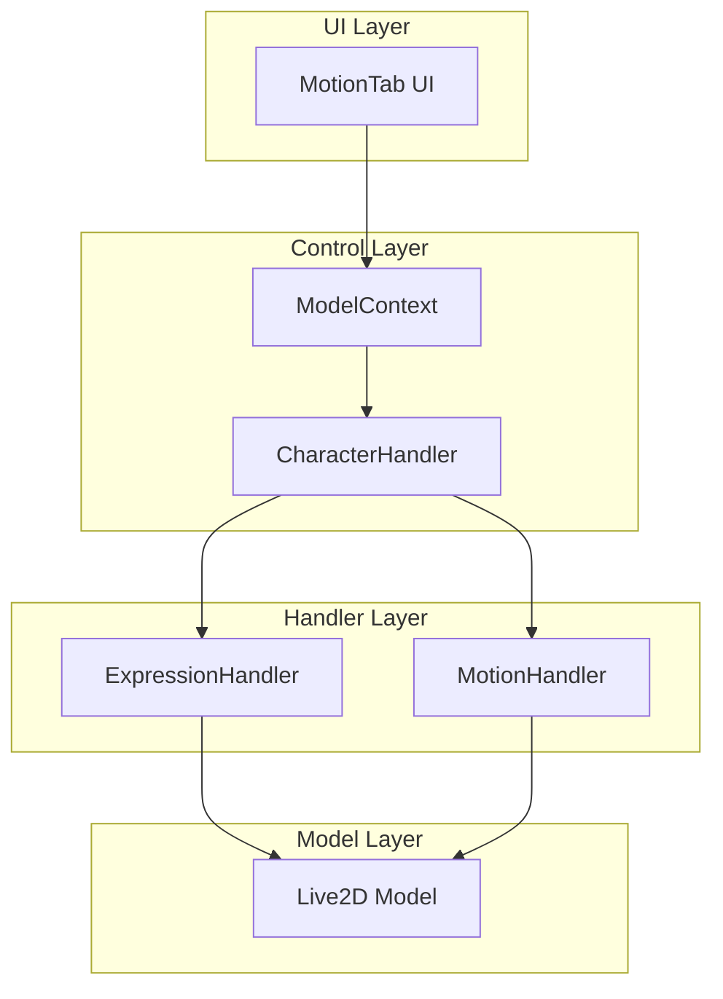

# Expression and Motion System Documentation

## Overview

The Expression and Motion system is a complex interaction between several components that manage Live2D model animations, expressions, and user interactions. This document outlines the architecture and flow of these systems.

## System Architecture



## Component Details

### 1. MotionTab UI Component
- Located in `app/aidol/components/ui/config/MotionTab.tsx`
- Provides user interface for:
  - Quick expression buttons (Wink, Cute Frown, Laugh Smile, Default)
  - Custom expression input
  - Motion group selection
  - Motion index selection
  - Play motion button
  - Play expression button

### 2. ModelContext
- Central state management for the Live2D model
- Manages:
  - Model state (loading, path, position, scale)
  - Motion state (expressionId, motionGroup, motionIndex, isPlaying)
  - Character handler reference
- Provides handlers for:
  - Expression changes
  - Motion group changes
  - Motion index changes
  - Motion playback
  - Model expressions

### 3. CharacterHandler
- Core coordination point for model interactions
- Manages:
  - Audio playback and lip-sync
  - Expression transitions
  - Motion playback
  - Model configuration
- Coordinates between:
  - ExpressionHandler
  - MotionHandler
  - Model state
  - Audio system

### 4. ExpressionHandler
- Handles model expressions and transitions
- Features:
  - Expression application with duration
  - Smooth transitions between expressions
  - Expression reset functionality
  - Lip-sync integration
- Methods:
  - `setExpression(expressionId, duration)`
  - `resetExpression()`
  - `updateMouth(volume, expression)`

### 5. MotionHandler
- Manages model motion playback
- Features:
  - Motion priority system
  - Motion group management
  - Animation index control
  - Motion options (sound, volume, expression)
- Methods:
  - `playMotion(categoryName, animationIndex, priorityNumber, options)`
  - `stopMotion()`

## Data Flow

### Expression Application Flow
1. User clicks expression button in MotionTab
2. MotionTab calls `handleExpressionClick`
3. ModelContext's `handleModelExpression` is triggered
4. CharacterHandler's `setModelExpression` is called
5. ExpressionHandler applies the expression to the model
6. Expression transitions are managed with duration
7. Expression resets after specified duration

### Motion Playback Flow
1. User selects motion group and index in MotionTab
2. User clicks play motion button
3. MotionTab calls `handlePlayMotionClick`
4. ModelContext's `handlePlayMotion` is triggered
5. CharacterHandler's `playModelMotion` is called
6. MotionHandler executes the motion with specified priority
7. Motion state is updated throughout the process

## State Management

### Motion State
```typescript
interface MotionState {
  expressionId: number;
  motionGroup: string;
  motionIndex: number;
  isPlaying: boolean;
}
```

### Expression Configuration
```typescript
interface ModelConfig {
  expressions?: Array<{
    parameters: Array<{
      id: string;
      value: number;
    }>;
  }>;
  version?: 'v2' | 'v3';
  parameters?: {
    mouthOpen?: string;
    mouthForm?: string;
    // ... other parameters
  };
}
```

## Usage Examples

### Applying an Expression
```typescript
// In MotionTab
const handleExpressionClick = (expressionId: number) => {
  handleModelExpression({
    expressionId,
    duration: 2000 // 2 seconds
  });
};
```

### Playing a Motion
```typescript
// In MotionTab
const handlePlayMotionClick = () => {
  handlePlayMotion();
};
```

## Current Limitations and Known Issues

1. Expression transitions may not be smooth when interrupted by new expressions
2. Motion playback may conflict with expression changes
3. Expression state may not properly reset after motion completion
4. UI feedback for active expressions could be improved

## Future Improvements

1. Implement expression blending for smoother transitions
2. Add expression preview functionality
3. Improve motion-expression coordination
4. Add expression combination support
5. Implement expression queuing system

## Debugging

Common issues and their solutions:

1. Expression not showing:
   - Check if model is properly loaded
   - Verify expression ID is valid
   - Check CharacterHandler state
   - Verify ExpressionHandler is properly initialized

2. Motion not playing:
   - Verify motion group exists
   - Check motion index is valid
   - Ensure model is in correct state
   - Check MotionHandler priority settings

3. Expression-Motion conflicts:
   - Check priority settings
   - Verify timing of expression resets
   - Ensure proper state management
   - Check for race conditions 