# Live2D Model Loading Architecture

This document explains how Live2D models are loaded and managed in the Vaidol application, including the complete flow from initialization to rendering.

## Overview

The Live2D model loading system is built with a modular architecture that separates concerns and provides a clean interface for model management. The system handles both Cubism 2.1 and Cubism 4.0 models, with automatic detection and appropriate library loading.

## Architecture Components

### Core Components

1. **ModelContext** - Central state management for model configuration
2. **WebSocketContext** - Handles real-time communication and audio data
3. **CharacterHandler** - Manages model interactions, audio, and animations
4. **ModelLoader** - Handles the actual loading of Live2D models
5. **useLiveModel Hook** - Provides a clean interface for components
6. **Specialized Hooks** - Handle specific aspects like audio, expressions, and interactions

## Model Loading Flow

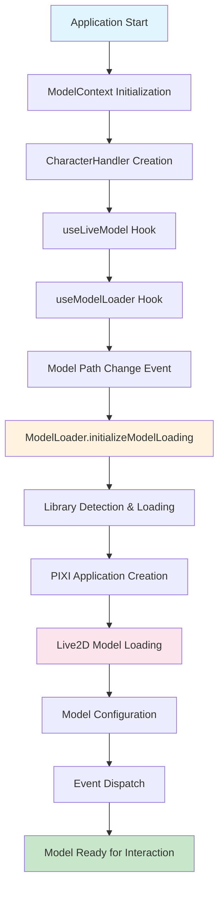

## Detailed Component Interactions

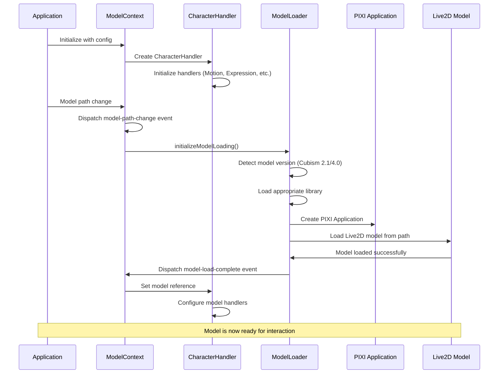

## State Management Architecture

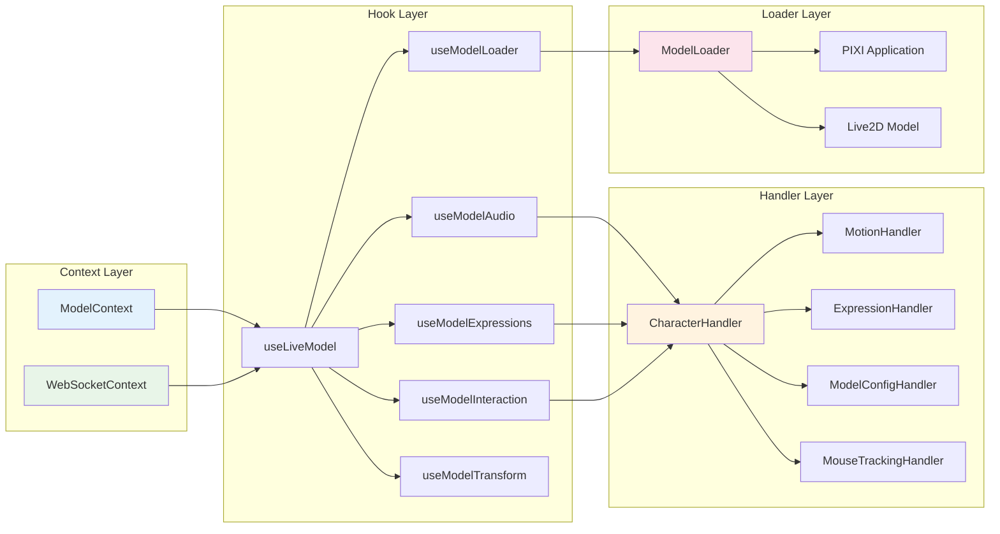

## Model Loading Process

### 1. Initialization Phase

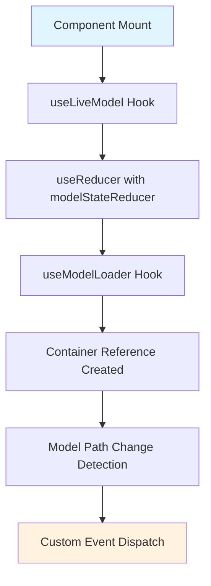

### 2. Library Loading Phase

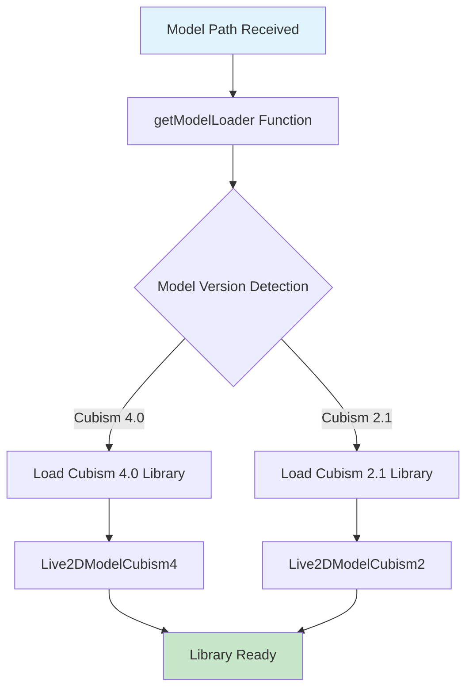

### 3. PIXI Application Setup

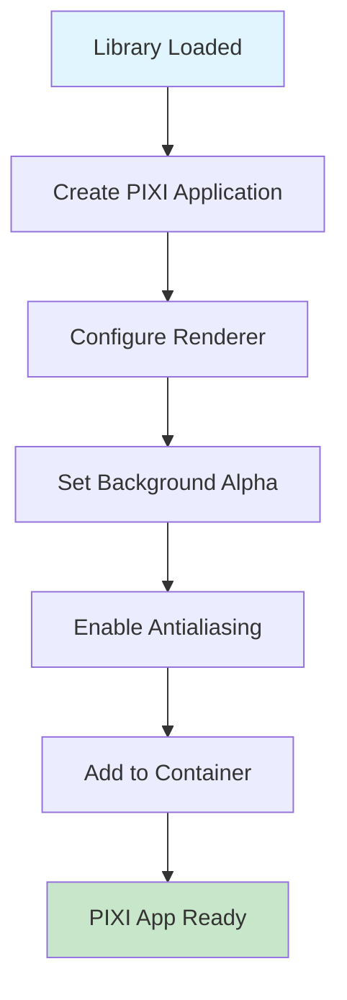

### 4. Live2D Model Loading

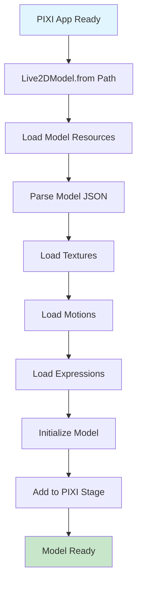

## Character Handler Integration

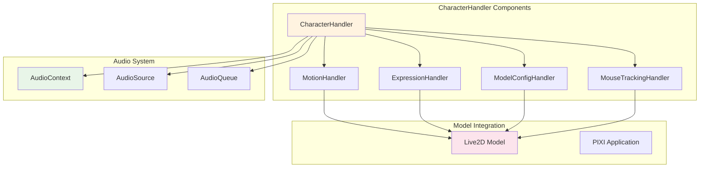

## Event Flow System

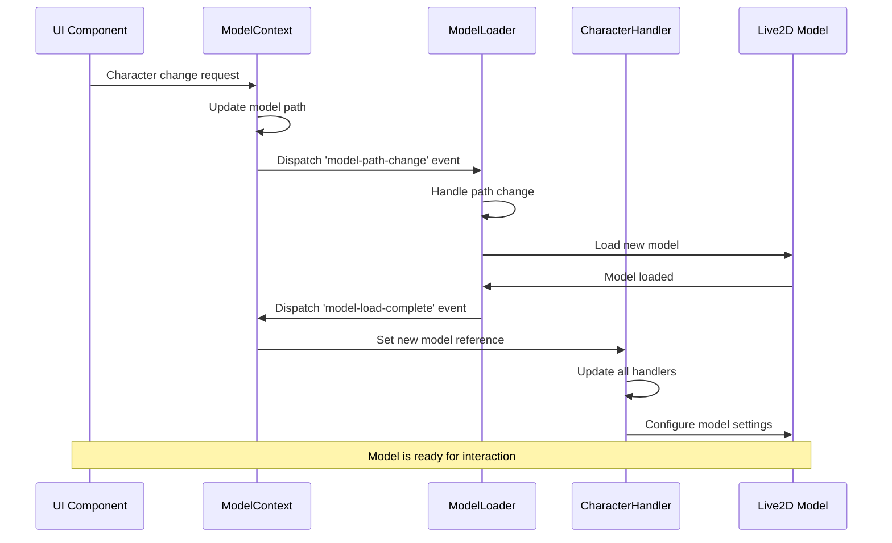

## Audio Integration Flow

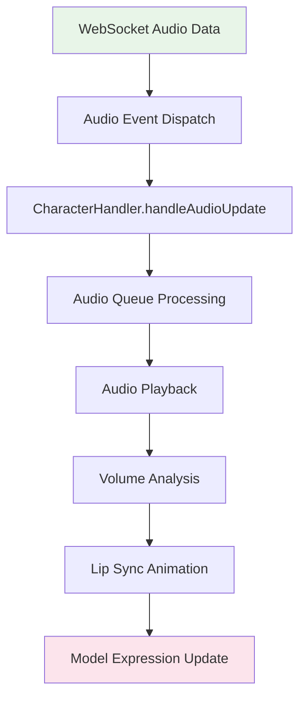

## Error Handling and Fallbacks

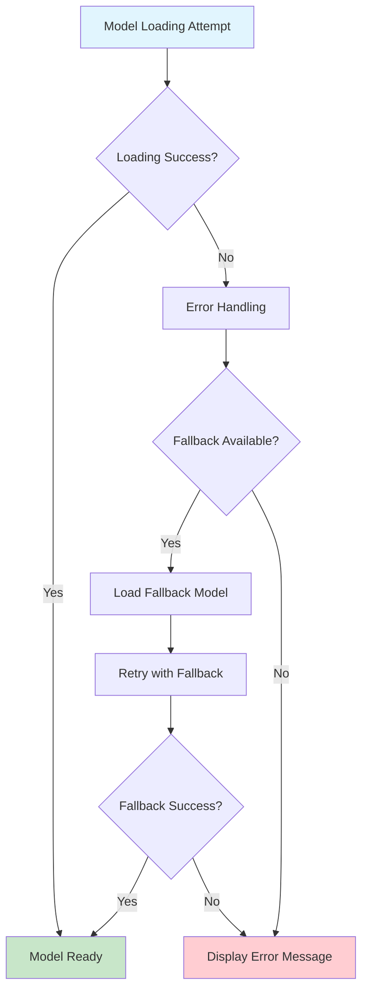

## Configuration Management

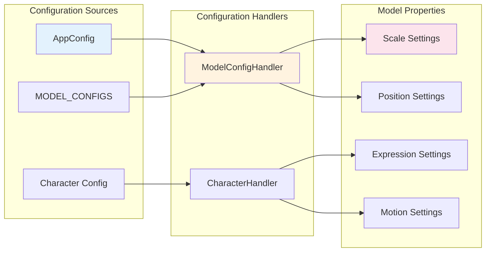

## Key Features

### 1. **Automatic Model Version Detection**
- Detects Cubism 2.1 vs 4.0 models automatically
- Loads appropriate library based on model format
- Handles different model file structures

### 2. **Modular Architecture**
- Separated concerns with specialized handlers
- Clean interfaces between components
- Easy to extend and maintain

### 3. **Real-time Audio Integration**
- WebSocket-based audio streaming
- Automatic lip-sync animation
- Volume-based expression changes

### 4. **Interactive Features**
- Mouse tracking for eye movement
- Touch/click interactions
- Scroll-based scaling
- Expression and motion control

### 5. **Error Handling**
- Graceful fallback mechanisms
- Comprehensive error logging
- User-friendly error messages

## Usage Example

```typescript
// Using the useLiveModel hook
const {
  shouldRender,
  isLoading,
  modelLoaded,
  containerRef,
  modelPosition,
  setModelPosition
} = useLive2DModel({
  modelPath: '/model/woodDog_vts/woodDog.model3.json',
  width: 800,
  height: 600,
  scale: 0.4,
  position: { x: 0.5, y: 0.5 },
  isPointerInteractive: true,
  isScrollToResizeEnabled: false,
  currentAudio: audioData,
  onExpression: (id, duration) => {
    console.log(`Expression ${id} for ${duration}ms`);
  }
});
```

## File Structure

```
app/(app)/aidol/components/contexts/
├── ModelContext.tsx              # Central state management
├── WebSocketContext.tsx          # WebSocket communication
├── useLiveModel.tsx              # Main hook interface
├── character/
│   ├── CharacterController.ts    # Main character handler
│   ├── ModelHandlers.ts          # Model interaction handlers
│   └── handler/                  # Specialized handlers
├── hooks/                        # Specialized hooks
├── loaders/
│   └── ModelLoader.tsx           # Model loading logic
└── types/                        # Type definitions
```

This architecture provides a robust, scalable solution for Live2D model management with clear separation of concerns and comprehensive error handling.
