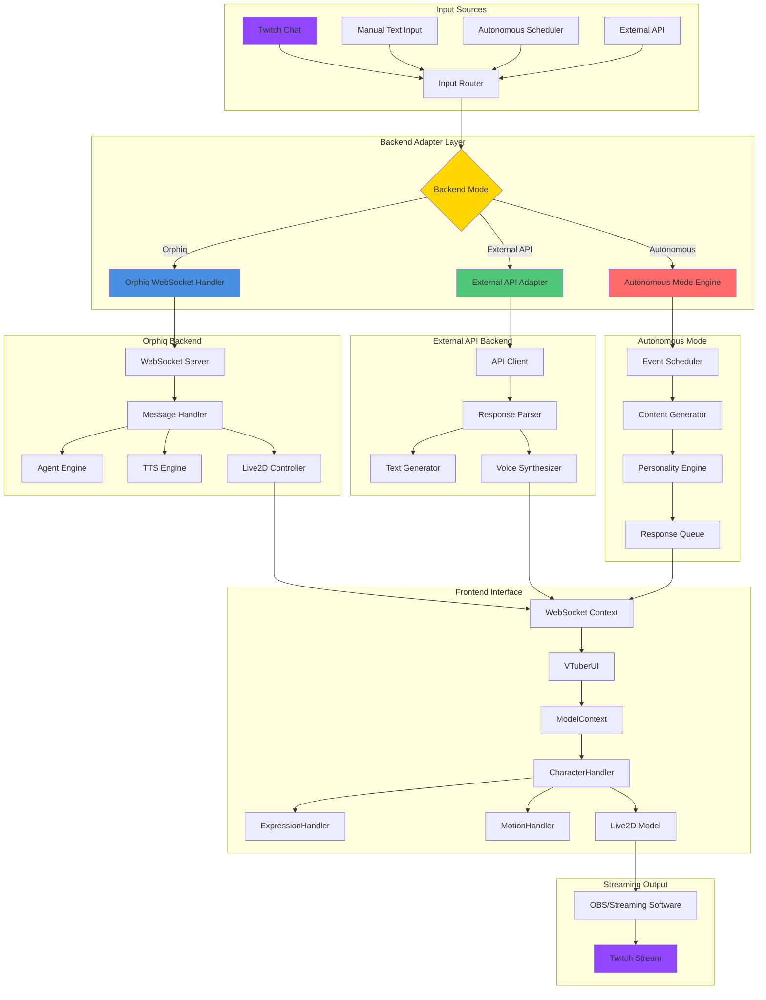
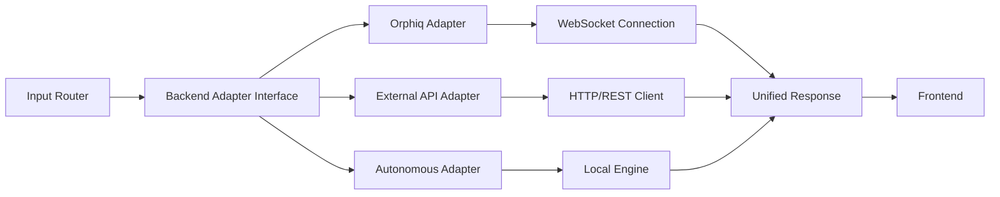
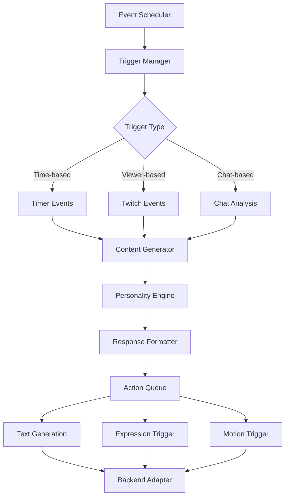

# Twitch Livestreaming Architecture

## Overview

This document outlines the architecture and implementation plan for enabling Twitch livestreaming capabilities with the VTuber application. The system will support text generation on demand, character movement and expressions on demand, and multiple backend modes (autonomous, external API, or existing orphiq backend).

## System Architecture



## Component Details

### 1. Input Sources

#### Twitch Chat Integration
- **Purpose**: Capture chat messages from Twitch stream
- **Implementation**: 
  - Twitch IRC or PubSub WebSocket connection
  - Message filtering and moderation
  - Command parsing (e.g., `!expression happy`, `!motion wave`)
- **Location**: New component `app/(app)/aidol/components/twitch/TwitchChatHandler.tsx`

#### Manual Text Input
- **Purpose**: Allow streamer to manually trigger responses
- **Implementation**: 
  - Existing `ChatInput` component
  - Enhanced with quick action buttons
  - Keyboard shortcuts for common actions
- **Location**: Existing `app/(app)/aidol/components/ui/ChatInput.tsx`

#### Autonomous Scheduler
- **Purpose**: Generate content automatically based on triggers
- **Implementation**:
  - Time-based triggers (every N minutes)
  - Event-based triggers (viewer milestones, follows, etc.)
  - Context-aware content generation
- **Location**: New component `app/(app)/aidol/components/autonomous/AutonomousScheduler.tsx`

#### External API Integration
- **Purpose**: Connect to third-party services for text generation
- **Implementation**:
  - REST/WebSocket API client
  - Response format standardization
  - Error handling and fallback
- **Location**: New component `app/(app)/aidol/components/api/ExternalAPIClient.tsx`

### 2. Backend Adapter Layer

The adapter layer provides a unified interface regardless of which backend is active.



#### Backend Adapter Interface
- **Purpose**: Abstract backend differences
- **Methods**:
  - `generateText(prompt: string, context?: StreamContext): Promise<string>`
  - `triggerExpression(expressionId: number, duration?: number): Promise<void>`
  - `triggerMotion(motionGroup: string, motionIndex: number): Promise<void>`
  - `getCharacterState(): Promise<CharacterState>`
- **Location**: New file `app/(app)/aidol/components/adapters/BackendAdapter.ts`

#### Orphiq Adapter
- **Purpose**: Connect to existing orphiq backend
- **Implementation**:
  - Uses existing WebSocket connection (`WebSocketContext`)
  - Maps adapter methods to WebSocket messages
  - Handles response parsing and state management
- **Location**: New file `app/(app)/aidol/components/adapters/OrphiqAdapter.ts`

#### External API Adapter
- **Purpose**: Connect to external services (OpenAI, Anthropic, etc.)
- **Implementation**:
  - REST API client with authentication
  - Response parsing and formatting
  - Error handling and retry logic
- **Location**: New file `app/(app)/aidol/components/adapters/ExternalAPIAdapter.ts`

#### Autonomous Adapter
- **Purpose**: Generate content locally without external services
- **Implementation**:
  - Local LLM integration (if available)
  - Pre-defined response templates
  - Personality-based content generation
  - Scheduled event triggers
- **Location**: New file `app/(app)/aidol/components/adapters/AutonomousAdapter.ts`

### 3. Text Generation on Demand

#### API Interface
```typescript
interface TextGenerationRequest {
  prompt: string;
  context?: {
    chatHistory?: Message[];
    streamInfo?: StreamInfo;
    characterPersona?: string;
  };
  options?: {
    maxLength?: number;
    temperature?: number;
    style?: 'casual' | 'formal' | 'excited' | 'calm';
  };
}

interface TextGenerationResponse {
  text: string;
  metadata?: {
    tokensUsed?: number;
    generationTime?: number;
    model?: string;
  };
}
```

#### Integration Points
- **Existing UI**: Extends `ChatInput` component to support generation requests
- **WebSocket**: Uses existing WebSocket connection for orphiq backend
- **REST API**: New HTTP client for external APIs
- **Local**: In-memory generation for autonomous mode

### 4. Character Movement and Expressions on Demand

#### Expression Control API
```typescript
interface ExpressionControl {
  expressionId: number;
  duration?: number; // milliseconds, 0 = permanent
  priority?: number; // higher priority overrides lower
  transition?: 'instant' | 'smooth' | 'ease-in-out';
}

interface MotionControl {
  motionGroup: string;
  motionIndex: number;
  loop?: boolean;
  priority?: number;
}
```

#### Integration with Existing System
- **ExpressionHandler**: Already exists at `app/(app)/aidol/components/contexts/character/handler/ExpressionHandler.ts`
  - Extend with priority system
  - Add transition types
  - Support queue management
  
- **MotionHandler**: Already exists at `app/(app)/aidol/components/contexts/character/handler/MotionHandler.ts`
  - Add loop support
  - Add priority system
  - Support motion queuing

#### Command Interface
- **Twitch Commands**: `!expression <id>`, `!motion <group> <index>`
- **API Endpoints**: REST endpoints for programmatic control
- **WebSocket Messages**: Extend existing WebSocket protocol

### 5. Autonomous Mode

#### Architecture


#### Components

**Event Scheduler**
- Manages time-based triggers
- Handles Twitch event subscriptions
- Coordinates autonomous actions

**Content Generator**
- Generates contextually appropriate responses
- Uses personality traits and character persona
- Maintains conversation context

**Personality Engine**
- Defines character behavior patterns
- Manages emotional state
- Determines response style and timing

**Action Queue**
- Queues generated actions
- Manages priority and timing
- Prevents action conflicts

### 6. Backend Mode Switching

#### Mode Selection
```typescript
type BackendMode = 'orphiq' | 'external-api' | 'autonomous';

interface BackendConfig {
  mode: BackendMode;
  orphiq?: {
    websocketUrl: string;
  };
  externalApi?: {
    provider: 'openai' | 'anthropic' | 'custom';
    apiKey: string;
    endpoint?: string;
  };
  autonomous?: {
    personality: PersonalityConfig;
    triggers: TriggerConfig[];
  };
}
```

#### Dynamic Switching
- Runtime mode switching without restart
- State preservation during switch
- Graceful fallback if primary backend fails

## Implementation Phases

### Phase 1: Backend Adapter Layer
1. Create `BackendAdapter` interface
2. Implement `OrphiqAdapter` using existing WebSocket
3. Create adapter factory for mode selection
4. Add configuration UI for backend selection

### Phase 2: Text Generation on Demand
1. Extend `ChatInput` with generation controls
2. Implement text generation API in adapters
3. Add response formatting and display
4. Integrate with existing chat UI

### Phase 3: Character Control API
1. Extend `ExpressionHandler` with priority system
2. Extend `MotionHandler` with queuing
3. Create command parser for Twitch chat
4. Add REST endpoints for programmatic control

### Phase 4: Twitch Integration
1. Implement Twitch IRC/PubSub client
2. Create chat message parser
3. Add command recognition
4. Integrate with input router

### Phase 5: Autonomous Mode
1. Implement event scheduler
2. Create content generator
3. Build personality engine
4. Add action queue system

### Phase 6: External API Integration
1. Create external API adapter
2. Implement authentication
3. Add response parsing
4. Create fallback mechanisms

### Phase 7: Streaming Integration
1. Add OBS integration (if needed)
2. Create streaming overlay components
3. Add stream status indicators
4. Implement stream analytics

## Technical Considerations

### Performance
- **WebSocket Connection**: Maintain single connection, multiplex messages
- **Action Queue**: Limit queue size, implement priority system
- **Response Caching**: Cache common responses for autonomous mode
- **Rate Limiting**: Prevent API abuse and manage costs

### Reliability
- **Error Handling**: Graceful degradation on backend failures
- **Reconnection Logic**: Auto-reconnect for WebSocket connections
- **Fallback Modes**: Switch to autonomous if external services fail
- **State Persistence**: Save state for recovery after crashes

### Security
- **API Key Management**: Secure storage of API keys
- **Input Sanitization**: Sanitize all user inputs
- **Rate Limiting**: Prevent abuse of text generation
- **Authentication**: Secure backend mode switching

### Scalability
- **Message Queue**: Handle high chat volume
- **Concurrent Requests**: Manage multiple simultaneous requests
- **Resource Management**: Monitor and limit resource usage
- **Caching Strategy**: Cache frequently used data

## Integration with Existing System

### WebSocket Protocol Extensions
```typescript
// New message types for Twitch streaming
interface TwitchChatMessage {
  type: 'twitch-chat';
  username: string;
  message: string;
  timestamp: number;
}

interface ExpressionCommand {
  type: 'expression-command';
  expressionId: number;
  duration?: number;
}

interface MotionCommand {
  type: 'motion-command';
  motionGroup: string;
  motionIndex: number;
}
```

### ModelContext Extensions
- Add backend mode state
- Add adapter instance
- Add command queue
- Add autonomous mode state

### CharacterHandler Extensions
- Add priority-based expression system
- Add motion queuing
- Add command processing
- Add state synchronization

## Testing Strategy

1. **Unit Tests**: Test each adapter independently
2. **Integration Tests**: Test adapter switching
3. **E2E Tests**: Test full flow from input to character action
4. **Load Tests**: Test with high chat volume
5. **Failure Tests**: Test error handling and recovery

## Future Enhancements

1. **Multi-character Support**: Multiple characters in one stream
2. **Advanced AI**: More sophisticated personality and response generation
3. **Stream Analytics**: Real-time analytics and insights
4. **Custom Commands**: User-defined command system
5. **Integration Hub**: Connect to other streaming platforms (YouTube, etc.)

