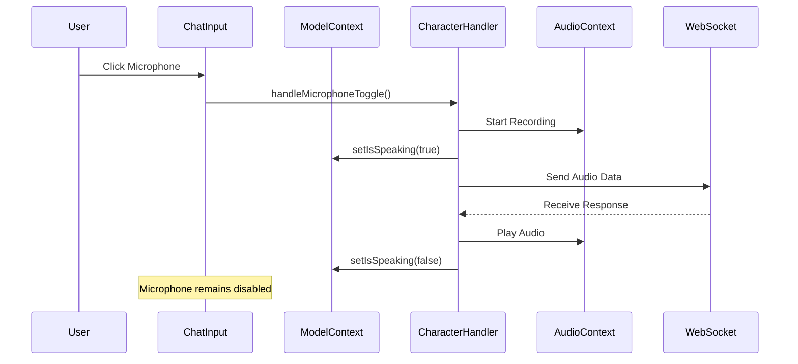
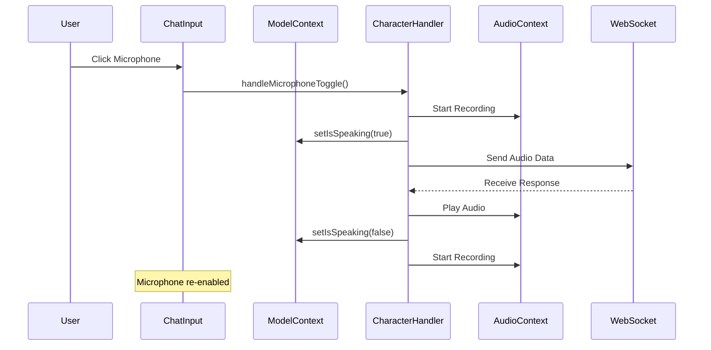
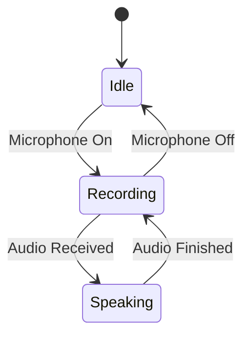

# Microphone State Flow Analysis

## Current Implementation

### State Management
- `isSpeaking` (ModelContext): Tracks when the character is speaking
- `isRecording` (VTuberUI): Tracks when microphone is active
- `isPlayingAudio` (CharacterHandler): Internal state for audio playback

### Key Components
1. **ChatInput.tsx**
   - Displays microphone button
   - Uses `isSpeaking` from ModelContext
   - Disables microphone when `isSpeaking` is true

2. **CharacterHandler.ts**
   - Manages audio playback
   - Sets `isSpeaking` state via `setIsSpeaking` prop
   - Handles microphone permissions and audio processing

3. **ModelContext.tsx**
   - Provides `isSpeaking` state
   - Passes `setIsSpeaking` to CharacterHandler
   - Manages audio context

### Current Flow


## Problem Analysis

### Current Issues
1. Microphone remains disabled after character finishes speaking
2. No automatic re-enabling of microphone
3. State management is fragmented across components

### Root Cause
The `isSpeaking` state is set to false when audio playback ends, but there's no mechanism to re-enable the microphone. The microphone button remains disabled because it's tied to the `isSpeaking` state.

## Proposed Solution

### Simplified Approach
Instead of modifying the audio processing or adding complex state management, we can:
1. Keep the existing `isSpeaking` state
2. Add a simple state reset in the CharacterHandler when audio playback ends
3. Use the existing `handleMicrophoneToggle` function

### Implementation Flow


### Key Changes
1. In `CharacterHandler.ts`, after audio playback ends:
   ```typescript
   onFinish: () => {
       console.log('[CharacterHandler] Audio playback finished');
       this.isPlayingAudio = false;
       this.props.isPlayingRef.current = false;
       this.props.setIsSpeaking(false);
       // Re-enable microphone
       this.handleMicrophoneToggle();
   }
   ```

### Benefits
1. Minimal code changes
2. Uses existing state management
3. Maintains current audio processing flow
4. No need for additional useEffect hooks
5. Preserves existing component structure

### Considerations
1. This approach assumes the user wants continuous recording
2. May need additional state to track user preferences
3. Could add a configurable delay before re-enabling

## State Management Diagram


## File Dependencies
```
app/
├── aidol/
│   ├── components/
│   │   ├── contexts/
│   │   │   ├── ModelContext.tsx
│   │   │   └── character/
│   │   │       └── CharacterController.ts
│   │   ├── ui/
│   │   │   └── ChatInput.tsx
│   │   └── VTuberUI.tsx
```

## State Flow
1. Initial State:
   - `isSpeaking`: false
   - `isRecording`: false
   - `isPlayingAudio`: false

2. Microphone Activation:
   - User clicks microphone
   - `isRecording` set to true
   - Audio processing begins

3. Audio Playback:
   - Character receives response
   - `isSpeaking` set to true
   - Audio playback begins

4. Playback Completion:
   - Audio finishes
   - `isSpeaking` set to false
   - Microphone automatically re-enabled

This solution maintains the existing architecture while adding the desired functionality with minimal changes. 