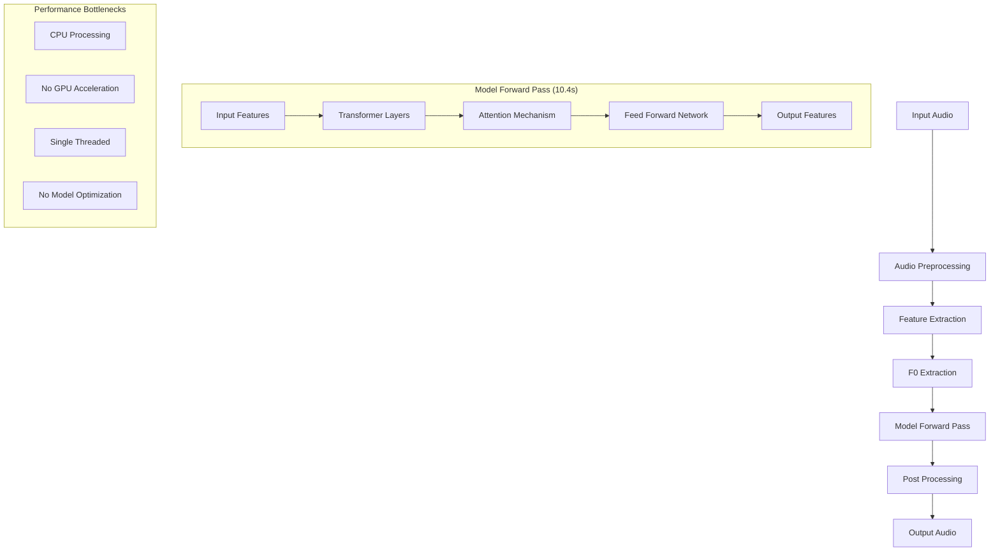

# Voice Conversion Performance Analysis

## Current Performance

The voice conversion pipeline currently takes approximately 15 seconds to process audio, with the following breakdown:
- Model forward pass: ~10.4 seconds (69% of total time)
- F0 extraction: ~1.7 seconds (11% of total time)
- Feature extraction: ~0.8 seconds (5% of total time)
- Other operations: ~2.3 seconds (15% of total time)

## Architecture Overview

## Why is the Forward Pass Slow?

The model forward pass is slow due to several factors:

1. **Hardware Limitations**
   - Running on CPU instead of GPU
   - No hardware acceleration
   - Limited parallel processing capabilities

2. **Model Architecture**
   - 12 transformer layers
   - 768 embedding dimensions
   - 12 attention heads per layer
   - Large feed-forward networks (3072 dimensions)

3. **Processing Pipeline**
   - Sequential processing of audio chunks
   - No batch processing
   - Memory transfers between CPU and model
   - No model quantization

## Optimization Opportunities

1. **Hardware Acceleration**
   - Enable GPU support
   - Use hardware-specific optimizations
   - Implement parallel processing

2. **Model Optimization**
   - Implement model quantization (int8/float16)
   - Apply model pruning
   - Use model compression techniques
   - Optimize transformer architecture

3. **Processing Pipeline**
   - Implement batch processing
   - Cache intermediate results
   - Optimize memory transfers
   - Use parallel processing for F0 extraction

4. **System Level**
   - Enable multi-threading
   - Implement distributed computing
   - Use optimized libraries (e.g., ONNX Runtime)
   - Profile and optimize memory usage

## Implementation Priority

1. **High Priority**
   - Enable GPU support
   - Implement model quantization
   - Add batch processing

2. **Medium Priority**
   - Optimize memory transfers
   - Implement caching
   - Enable multi-threading

3. **Low Priority**
   - Model architecture changes
   - Distributed computing
   - Advanced optimizations

## Expected Improvements

With optimizations, we can expect:
- 3-5x speedup with GPU support
- 2-3x speedup with model quantization
- 1.5-2x speedup with batch processing
- 1.2-1.5x speedup with memory optimizations

Total potential improvement: 5-10x faster processing 