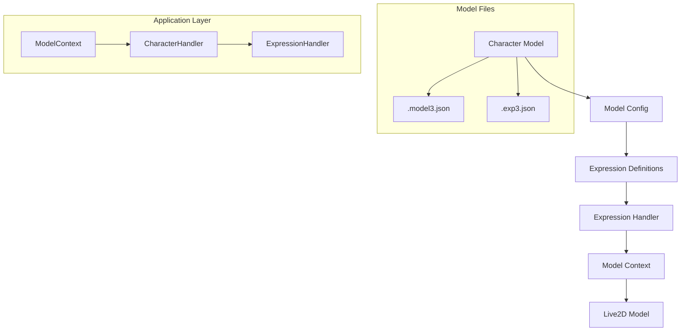
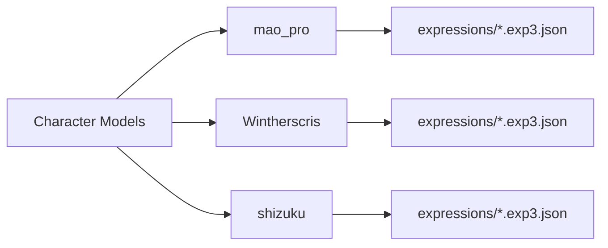
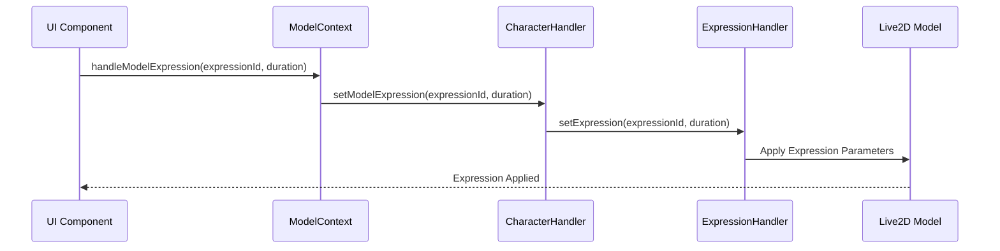

# Live2D Character Expression Management

This document explains how expressions are managed in the Live2D character system, including how different character models handle their expressions and how they are integrated into the application.

## Expression System Overview



## Expression File Structure

Each character model has its own expression files in their respective directories:



## Expression Flow



## Expression Configuration

Each character model has its own expression configuration defined in the model files:

1. **Model Definition** (.model3.json):
   - Contains base model parameters
   - Defines expression parameter mappings
   - Specifies expression file locations

2. **Expression Files** (.exp3.json):
   - Contains specific expression parameter values
   - Defines how parameters change for each expression
   - Can include multiple expressions per file

## Implementation Details

### 1. Model Loading
- Models are loaded with their associated expression files
- Expression configurations are parsed from .exp3.json files
- Parameter mappings are established from .model3.json

### 2. Expression Application
- Expressions are applied through the CharacterHandler
- The ExpressionHandler manages the transition between expressions
- Parameters are smoothly interpolated during transitions

### 3. Expression Management
- Expressions can be triggered by:
  - Audio playback
  - User interaction
  - Programmatic control
  - Motion sequences

## Best Practices for Character Implementation

1. **Expression Organization**
   - Keep expression files in a dedicated `expressions` directory
   - Use clear naming conventions for expression files
   - Document parameter mappings in model configuration

2. **Performance Optimization**
   - Preload commonly used expressions
   - Use efficient parameter interpolation
   - Cache expression parameter values

3. **Character-Specific Considerations**
   - Each character may have different parameter mappings
   - Some characters may support more expressions than others
   - Consider character-specific expression limitations

## Example Expression Structure

```json
{
  "Type": "Live2D Expression",
  "Parameters": [
    {
      "Id": "ParamMouthForm",
      "Value": 0.5
    },
    {
      "Id": "ParamEyeLOpen",
      "Value": 1.0
    }
  ]
}
```

## Integration with ModelContext

The ModelContext provides a centralized way to manage expressions:

1. **Expression State Management**
   - Tracks current expression
   - Manages expression transitions
   - Handles expression queuing

2. **Expression API**
   - `handleModelExpression`: Main method for applying expressions
   - `handleExpressionChange`: Updates expression state
   - `setModelExpression`: Direct model expression control

## Character-Specific Implementation

Different characters may require different approaches:

1. **mao_pro**
   - Uses .exp3.json format
   - Supports multiple expression files
   - Has specific parameter mappings

2. **Wintherscris**
   - Uses .exp3.json format
   - Has its own expression set
   - May have different parameter requirements

3. **shizuku**
   - Uses .exp3.json format
   - Has unique expression parameters
   - May require special handling

## Conclusion

The expression system is designed to be flexible and efficient, allowing for different character implementations while maintaining a consistent interface. When implementing new characters, consider:

1. Expression file organization
2. Parameter mapping consistency
3. Performance optimization
4. Character-specific requirements

This system allows for efficient loading and management of expressions across different character models while maintaining a unified interface for the application. 